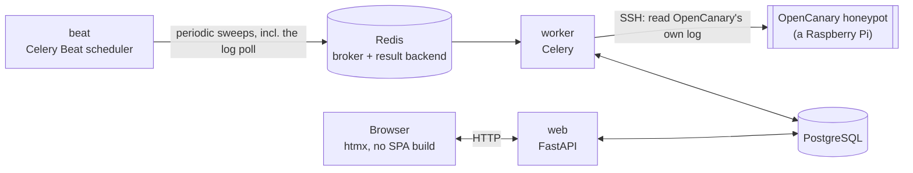

# 🏗️ Architecture

*Every honeypot lies for a living — this is the part of the app that has to tell the truth.*

This page covers the stack, project layout, the REST API, and the
cross-cutting security essentials (CSRF, headers, secrets at rest, FIPS
alignment). Everything feature-specific has its own page — split out so
a long single document doesn't get harder to search as this app grows:

| Page | Covers |
|---|---|
| [🔐 Authentication & RBAC](Authentication-RBAC.md) | Login/sessions/TOTP/WebAuthn/OIDC, the company-membership RBAC model, Impersonate |
| [🍯 Honeypot Management](Honeypot-Management.md) | Provisioning, VPN connectivity, the Config tab, the data model, how events arrive, syslog targets |
| [📝 Audit Log](Audit-Log.md) | Hash-chain integrity, retention, export, SIEM forwarding |
| [🔔 Notifications](Notifications.md) | Rules, scope, wording, the SSRF guard on webhooks |

## 🧱 Stack

| Layer | Choice | Notes |
|---|---|---|
| Language | Python 3.14 | |
| Web framework | FastAPI | async, OpenAPI schema for free |
| Templates / UI | Jinja2 + [htmx](https://htmx.org) (vendored locally) | no SPA build, no CDN |
| Database | PostgreSQL 18 | via `asyncpg` + SQLAlchemy 2.0 (async) |
| Migrations | Alembic | async engine |
| Task queue / broker | Redis | broker + result backend for [Celery](https://docs.celeryq.dev/); also backs the login rate limiter |
| Background tasks | Celery + Celery Beat | one `worker`, exactly one `beat` — never scale `beat` past 1 replica |
| Auth: passwords | [`argon2-cffi`](https://github.com/hynek/argon2-cffi) | argon2id |
| Auth: LDAP | [`ldap3`](https://github.com/cannatag/ldap3) | pure Python |
| Auth: OIDC | [`Authlib`](https://authlib.org/) | discovery, auth-code flow, ID token validation |
| Auth: TOTP | [`pyotp`](https://github.com/pyauth/pyotp) + [`qrcode`](https://github.com/lincolnloop/python-qrcode) | RFC 6238 |
| Auth: WebAuthn/passkeys | [`webauthn`](https://github.com/duo-labs/py_webauthn) | ceremony verification |
| Reverse proxy (optional) | [Caddy](https://caddyproxy.com/) | automatic HTTPS, TLS 1.3, HTTP/3 |
| Packaging | [`uv`](https://docs.astral.sh/uv/) | `uv.lock` is committed |
| Containers | Docker (multi-stage) + Compose | |

Carried over almost entirely — stack, layout, and most of the auth code
— from [debcontrol](https://github.com/sparkycz1/debcontrol), a sister
project for Debian fleets. See [CLAUDE.md](../CLAUDE.md) for the exact
"what was reused vs. what's different" ledger.



Unlike debcontrol's `Machine`, a `Honeypot` starts producing events with
no forwarder or push setup on its side at all — `web`/`worker` reach out
over SSH and read whatever's new in OpenCanary's own log. See
[Honeypot Management](Honeypot-Management.md#-how-events-arrive-an-ssh-poll-nothing-pushed).

## 📂 Project structure

```
app/
  audit.py      the single audit-log write path (hash chaining, verification) — from debcontrol, unchanged
  auth/         login (local/LDAP/OIDC), sessions, TOTP, WebAuthn, per-user API tokens,
                company scoping (app/auth/scope.py) — see Authentication & RBAC
  core/         config (pydantic-settings), logging, encryption, CSRF, editable app settings
  db/           SQLAlchemy models + async session
  schemas/      Pydantic schemas for forms
  services/     logic shared between routes (e.g. honeypot online/offline status)
  tasks/        Celery app (beat schedule, fork-safety hook) + the daily job bodies
  web/          FastAPI routers, Jinja2 templates, static files
alembic/        DB migrations
wiki/           this documentation
```

## 🌐 The REST API: read and write, mirroring the web UI

Authenticated with a per-user API token (`Authorization: Bearer`), not
a session cookie. A token can do whatever its owning account currently
permits, company-scoped exactly like the web UI — a second door into
the same house, not a looser one.

**Deliberately still web-UI-only**: SSH key rotation, LDAP/OIDC config,
and syslog forwarding (secret/credential surfaces or lock-out risk,
meant to be handled deliberately by a human); the interactive SSH
terminal (inherently interactive, no REST shape); the "Fix it"
readiness flow's one-time password (same secret-handling reason as key
rotation); Impersonate (see [Authentication & RBAC](Authentication-RBAC.md#impersonate-a-superadmin-signing-in-as-another-account)).

`GET /api/v1/events` (+ `/export`, CSV or JSON) is the read surface over
`HoneypotEvent` — filterable, paginated on the list endpoint. Mirrors
the audit log's own CSV-export shape (spreadsheet-formula-injection
guard included).

## 🔒 Security model

CSRF, strict CSP (no inline scripts/styles, no CDN — htmx and Swagger
UI vendored locally), security headers, secrets-at-rest encryption,
SSH host-key pinning (no trust-on-first-use), and the hash-chained
audit log are all unchanged from debcontrol in spirit — see that
project's own wiki for the exhaustive version.

**Deliberately out of scope**: no AI assistant, no user-definable
roles.

### Secrets at rest

Every `*_encrypted` column is **AES-256-GCM** — a fresh random nonce
per value. `decrypt_secret` still transparently reads the older Fernet
(AES-128-CBC) format this app used before v0.17.0, so nothing needs an
immediate migration; `scripts/reencrypt_secrets.py` upgrades every
remaining legacy value in one idempotent pass.

### FIPS alignment

Not **certified** — that needs a NIST-validated crypto module (a build/
deployment decision, not application code), and the stock
`python:3.14-slim` image isn't one. What the app *does* control: never
relying on an algorithm FIPS wouldn't approve, so a deployment that
needs real certification only swaps the crypto module underneath.

- Secrets at rest: AES-256-GCM, not Fernet's AES-128 — both are
  FIPS-approved; this is "prefer the stronger default," not a fix.
- Signed tickets: explicit SHA-256 rather than `itsdangerous`'s own
  HMAC-SHA1 default (itself still FIPS-approved — same reasoning).
- SSH connections restrict key exchange/encryption/MAC to an approved
  subset (NIST-curve ECDH or ≥2048-bit DH with SHA-2, AES-GCM/CTR,
  HMAC-SHA-2) — **except** the unauthenticated host-key-discovery probe
  (must stay unrestricted to learn what it's dealing with) and the
  accepted host-key algorithm itself (pinned by exact fingerprint, not
  algorithm).
- TOTP and WebAuthn already only use approved algorithms.

**The one deliberate exception: Argon2id for password hashing.**
FIPS/SP 800-132 only approves PBKDF2. This app keeps Argon2id anyway —
memory-hard, meaningfully more GPU/ASIC-resistant, which is exactly
what protects an account if the hash table ever leaks. A considered
trade-off, not an oversight.
