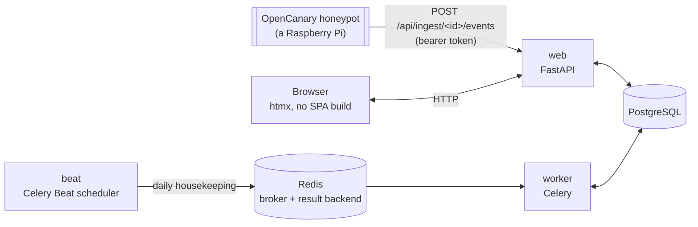

# 🏗️ Architecture

## 🧱 Stack

| Layer | Choice | Notes |
|---|---|---|
| Language | Python 3.14 | |
| Web framework | FastAPI | async, OpenAPI schema for free |
| Templates / UI | Jinja2 + [htmx](https://htmx.org) (vendored locally) | no SPA build, no CDN |
| Database | PostgreSQL 18 | via `asyncpg` + SQLAlchemy 2.0 (async) |
| Migrations | Alembic | async engine |
| Task queue / broker | Redis | broker + result backend for [Celery](https://docs.celeryq.dev/); also backs the login rate limiter |
| Background tasks | Celery + Celery Beat | one `worker` process, exactly one `beat` scheduler — three daily housekeeping jobs, no per-honeypot fan-out (see below) |
| Auth: passwords | [`argon2-cffi`](https://github.com/hynek/argon2-cffi) | argon2id hashing for local accounts |
| Auth: LDAP | [`ldap3`](https://github.com/cannatag/ldap3) | pure Python |
| Auth: OIDC | [`Authlib`](https://authlib.org/) | discovery, authorization-code flow, ID token validation |
| Auth: TOTP | [`pyotp`](https://github.com/pyauth/pyotp) + [`qrcode`](https://github.com/lincolnloop/python-qrcode) | RFC 6238 two-factor codes |
| Auth: WebAuthn/passkeys | [`webauthn`](https://github.com/duo-labs/py_webauthn) | registration/authentication ceremony verification |
| Reverse proxy (optional) | [Caddy](https://caddyproxy.com/) | automatic HTTPS, TLS 1.3 only, HTTP/3 |
| Packaging / lockfile | [`uv`](https://docs.astral.sh/uv/) | `uv.lock` is committed |
| Containers | Docker (multi-stage build) + Docker Compose | |

This entire stack — and most of the code implementing the auth row — is
carried over from [debcontrol](https://github.com/sparkycz1/debcontrol),
a sister project for the same team. See [CLAUDE.md](../CLAUDE.md) for what
was and wasn't reused.



**The data flow is inverted from debcontrol's**: debcontrol's `web`
process reaches out over SSH to managed machines. HoneyHive never reaches
into a honeypot at all — a honeypot's own forwarder pushes events in (see
[Honeypot Onboarding](Honeypot-Onboarding.md)). There is no SSH client
dependency in this codebase.

## 📂 Project structure

```
app/
  audit.py      the single audit-log write path (hash chaining, verification) — from debcontrol, unchanged
  auth/         login (local/LDAP/OIDC), sessions, TOTP, WebAuthn, per-user API tokens,
                company scoping (app/auth/scope.py) — see "Authentication & RBAC" below
  core/         config (pydantic-settings), logging, encryption, CSRF, editable app settings
  db/           SQLAlchemy models + async session
  schemas/      Pydantic schemas for forms
  services/     logic shared between routes (e.g. honeypot online/offline status)
  tasks/        Celery app (beat schedule, fork-safety hook) + the three daily job bodies
  web/          FastAPI routers, Jinja2 templates, static files
alembic/        DB migrations
wiki/           this documentation
```

## Authentication & RBAC

Login/session/TOTP/WebAuthn/LDAP/OIDC/rate-limiting/API-token machinery is
**copied from debcontrol nearly unchanged** — see that project's
`wiki/Architecture.md` for the exhaustive version of all of this (session
rows vs. signed cookies, brute-force lockout, per-IP rate limiting, TOTP
recovery codes, the WebAuthn ceremony, OIDC's own Starlette session, the
bootstrapping script). What's genuinely different is the authorization
model layered on top:

### No accounts are ever auto-created

Same as debcontrol: every `User` row is created inside HoneyHive first
(`scripts/create_admin.py` for the very first superadmin, the Users page
after that) — never by LDAP or OIDC. `auth_provider` only decides *how* an
existing account proves who it is.

### RBAC: company + access level, not roles

An admin does **not** define custom roles here. Every user is either:

- **A superadmin** (`User.is_superadmin = True`) — `company_id` and
  `access_level` are both `NULL`. Sees and manages everything, every
  company.
- **A company user** — `company_id` (required) points at exactly one
  `Company`; `access_level` is `READ` or `READ_WRITE`. `READ_WRITE` always
  implies everything `READ` grants; there is no third tier, and no way to
  grant access to more than one company short of being a superadmin.

Enforced at two independent layers, same separation of concerns debcontrol
used for permissions vs. machine-group scoping:

- **`app.auth.dependencies.require_write`** — is this user allowed to
  write *at all* (superadmin, or `READ_WRITE` on their own company)? Gates
  a route the way debcontrol's `require_permission(Permission.X)` did.
- **`app.auth.scope.ensure_company_access(user, company_id, write=...)`**
  / **`visible_company_id(user)`** — *which* company's data may this user
  touch? A superadmin passes for every company id; anyone else only for
  their own. **Out-of-scope reads 404, never 403** — a 403 would itself
  confirm the company/honeypot exists, which a user outside it shouldn't
  learn for free (same reasoning debcontrol's machine-group scoping
  documents).

There is no per-honeypot grant, no multi-company non-superadmin user, and
no custom-role editor — see `app/db/models/user.py`'s module docstring for
why this is deliberately much flatter than debcontrol's `Role`/
`Permission` matrix, and [Home.md](Home.md)'s open questions for what's
still unsettled about who's allowed to do what.

### Sessions, TOTP, WebAuthn, API tokens, OIDC, rate limiting

All unchanged in mechanism from debcontrol — `UserSession` rows (not
signed cookies), the same `SESSION_IDLE_TIMEOUT`/`SESSION_ABSOLUTE_MAX`,
self-service TOTP enrollment with recovery codes, WebAuthn/passkey
registration, per-user API tokens (prefixed `hhpat_` here, not `dcpat_`)
that authorize whatever the owning user's company + access level currently
permit, and the same per-IP login rate limiter. One deliberate
simplification: **there is no per-role mandatory TOTP enforcement** (no
`Role.require_totp` — there are no roles). TOTP/passkeys are purely
self-service today; a future "require 2FA for every user" toggle would
need to live on `AppSettings` instead, checked in
`app.auth.middleware`.

WebAuthn's origin check and OIDC's `redirect_uri` both depend on
`request.url.scheme` being correct, which needs
`app.core.proxy_headers.ProxyHeadersMiddleware` (registered outermost in
`app.main`) to have corrected it from `X-Forwarded-Proto` first when the
app sits behind a TLS-terminating reverse proxy — otherwise both derive
"http" no matter what the browser actually used, and WebAuthn fails with
"Unexpected client data origin". See that module's own docstring and
`Settings.trusted_proxy_ips` for why trusting it by default is safe, and
[Installation](Installation.md) for the `TRUSTED_PROXY_IPS` setting. The
same middleware also fixes `app.audit.log_event`'s recorded source IP and
the login rate limiter behind a proxy — see "Real client IP behind a
proxy" below.

**Login is two steps**, not one form: `GET /login` collects only the
username (plus the OIDC button, if enabled — its label reads "Log in with
OIDC" unless `AppSettings.oidc_provider_name` names the actual provider,
e.g. "Entra ID", set on Settings → Integrations), then `GET
/login/password?username=...` offers a passkey *or* a password for that
account — a passkey there signs straight in with no password ever
submitted, the same GitHub/Google-style "next screen" shape. `username`
travels between the two as a plain query param, the same way `next`
already does elsewhere — it isn't a secret, and nothing trusts it for
anything beyond "whose passkeys to offer"; the real authentication
(password, still checked by the unchanged `POST /login` that screen's
password form submits to; or WebAuthn) is what actually verifies the
account. The passkey button is always shown on step two regardless of
whether the named account actually has one or even exists —
`app.web.routes.auth._resolve_webauthn_login_user`'s own docstring covers
why that's deliberate (enumeration-resistance: a nonexistent username and
a real one with no passkey get an identical error). A passkey used this
way needs no further second factor — it already *is* one — so it goes
straight to `_finish_login`, the same function a post-password TOTP/
passkey confirmation ends at. TOTP/passkey-as-second-factor after a
password (`/login/totp`) is unchanged.

**Real client IP behind a proxy.** `app.audit.log_event`'s recorded
`ip_address` and the login/TOTP rate limiter's per-source bucket key both
read `request.client.host` — correct out of the box when this app's own
network namespace is what a reverse proxy connects to, but the proxy's
own IP once one runs as a separate host/container (e.g. Traefik on a
different machine) instead. `Settings.trust_forwarded_for`
(`TRUST_FORWARDED_FOR`, off by default) tells the same
`ProxyHeadersMiddleware` above to also correct `request.client` from
`X-Forwarded-For` — off by default, unlike scheme trust, because trusting
it from just anyone would let an attacker spoof a different "source" on
every login/TOTP attempt and defeat the rate limiter entirely. Only turn
it on once `TRUSTED_PROXY_IPS` is narrowed to your real proxy's own
address (not the default `*`) — see `app.core.proxy_headers`'s own
docstring.

## 🌱 Initialize: provisioning a brand new device

[Initialize](Honeypot-Initialize.md) (top nav) is the one write path in
this app that connects over SSH to a device **that has no `Honeypot` row
at all** — every other SSH-connecting feature (`app.ssh.*`, all gated
through a real `Honeypot`) requires one first. It's a standalone,
one-shot provisioning script (`app.ssh.initialize`, dispatched by
`app.tasks.jobs.run_honeypot_initialize`) adapted from the team's own
Ansible playbook, run before a device is ever added to HoneyHive.
Because there's no prior `Honeypot.host_key_fingerprint` to check
against, host-key trust here is deliberately trust-on-first-use — the one
explicit exception to the strict pinned-verification policy
`app.ssh.client` otherwise enforces everywhere. A throwaway, never-
persisted `Honeypot` instance carries the connection details through to
the same `open_connection`/`run_command` helpers every other honeypot
feature uses, so that policy still applies uniformly once the
(TOFU-trusted) fingerprint is set on it.

## 🍯 Honeypot data model

- **`Company`** — a tenant. One row per customer.
- **`Honeypot`** — one deployed OpenCanary instance (one Raspberry Pi),
  belonging to exactly one `Company`. Identity + last-seen bookkeeping
  only; HoneyHive never connects to it.
- **`HoneypotEvent`** — one row per OpenCanary alert, close to OpenCanary's
  own JSON shape (`raw`), with `event_type`/`occurred_at`/`src_ip`/
  `src_port`/`dst_port` promoted to real columns for the common
  list/filter/dashboard queries. Denormalizes `company_id` onto the event
  itself so every scoped query avoids a join through `Honeypot`.
- **`CompanySnapshot`** — one row per company per day, written by a daily
  Celery Beat job, backing the Dashboard's trend sparkline — mirrors
  debcontrol's `FleetSnapshot` one-to-one.

### How events actually arrive

OpenCanary itself has no built-in "POST to a URL" output — it only writes
to a local log/its own handlers. `POST
/api/ingest/{honeypot_id}/events` (`app/web/routes/ingest.py`) is what a
small forwarder on the Pi calls, authenticated with either the shared
`INGEST_TOKEN` (bootstrap, same shape as debcontrol's `INFORM_TOKEN`) or a
per-honeypot token (`Honeypot.ingest_token_hash` — model exists, no UI to
generate one yet). See [Honeypot Onboarding](Honeypot-Onboarding.md).

"Online"/"offline" (`app/services/honeypot_status.py`) is purely derived
from `Honeypot.last_seen_at` vs. `HONEYPOT_OFFLINE_AFTER_SECONDS` — no
separate reachability check exists (there's nothing to reach).

## 🔒 Security model

CSRF, CSP (strict, no inline scripts/styles, no CDN — htmx and Swagger UI
vendored locally), security headers, secrets-at-rest encryption
(`ENCRYPTION_KEY`, Fernet — used for LDAP/OIDC secrets, SSH credentials,
and per-honeypot ingest tokens), SSH host-key pinning (no trust-on-first-
use — identical to debcontrol's `Machine`), and the hash-chained audit log
are all unchanged from debcontrol. See that project's
`wiki/Architecture.md` "Security model" section for the exhaustive
version — it applies here without modification for everything under
`app/ssh/`.

**Deliberately out of scope** (unlike debcontrol): no AI assistant, no
user-definable roles (see "Authentication & RBAC" above for what replaces
them).
