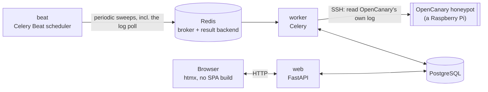

# 🏗️ Architecture

*Every honeypot lies for a living — this is the part of the app that has to tell the truth.*

## 🧱 Stack

| Layer | Choice | Notes |
|---|---|---|
| Language | Python 3.14 | |
| Web framework | FastAPI | async, OpenAPI schema for free |
| Templates / UI | Jinja2 + [htmx](https://htmx.org) (vendored locally) | no SPA build, no CDN |
| Database | PostgreSQL 18 | via `asyncpg` + SQLAlchemy 2.0 (async) |
| Migrations | Alembic | async engine |
| Task queue / broker | Redis | broker + result backend for [Celery](https://docs.celeryq.dev/); also backs the login rate limiter |
| Background tasks | Celery + Celery Beat | one `worker`, exactly one `beat` — never scale `beat` past 1 replica |
| Auth: passwords | [`argon2-cffi`](https://github.com/hynek/argon2-cffi) | argon2id |
| Auth: LDAP | [`ldap3`](https://github.com/cannatag/ldap3) | pure Python |
| Auth: OIDC | [`Authlib`](https://authlib.org/) | discovery, auth-code flow, ID token validation |
| Auth: TOTP | [`pyotp`](https://github.com/pyauth/pyotp) + [`qrcode`](https://github.com/lincolnloop/python-qrcode) | RFC 6238 |
| Auth: WebAuthn/passkeys | [`webauthn`](https://github.com/duo-labs/py_webauthn) | ceremony verification |
| Reverse proxy (optional) | [Caddy](https://caddyproxy.com/) | automatic HTTPS, TLS 1.3, HTTP/3 |
| Packaging | [`uv`](https://docs.astral.sh/uv/) | `uv.lock` is committed |
| Containers | Docker (multi-stage) + Compose | |

Carried over almost entirely — stack, layout, and most of the auth code
— from [debcontrol](https://github.com/sparkycz1/debcontrol), a sister
project for Debian fleets. See [CLAUDE.md](../CLAUDE.md) for the exact
"what was reused vs. what's different" ledger.



Unlike debcontrol's `Machine`, a `Honeypot` starts producing events with
no forwarder or push setup on its side at all — `web`/`worker` reach out
over SSH and read whatever's new in OpenCanary's own log, on the same
schedule as every other periodic sweep (see "How events arrive" below).

## 📂 Project structure

```
app/
  audit.py      the single audit-log write path (hash chaining, verification) — from debcontrol, unchanged
  auth/         login (local/LDAP/OIDC), sessions, TOTP, WebAuthn, per-user API tokens,
                company scoping (app/auth/scope.py) — see "Authentication & RBAC" below
  core/         config (pydantic-settings), logging, encryption, CSRF, editable app settings
  db/           SQLAlchemy models + async session
  schemas/      Pydantic schemas for forms
  services/     logic shared between routes (e.g. honeypot online/offline status)
  tasks/        Celery app (beat schedule, fork-safety hook) + the daily job bodies
  web/          FastAPI routers, Jinja2 templates, static files
alembic/        DB migrations
wiki/           this documentation
```

## Authentication & RBAC

Login/session/TOTP/WebAuthn/LDAP/OIDC/rate-limiting/API-token machinery
is **copied from debcontrol nearly unchanged** — see that project's own
wiki for the exhaustive version (session rows vs. signed cookies,
brute-force lockout, TOTP recovery codes, the WebAuthn ceremony, OIDC's
own session, the bootstrap script). What's genuinely different is the
authorization model on top of it:

### No accounts are ever auto-created

Every `User` row is created inside this app first
(`scripts/create_admin.py` for the first superadmin, the Users page
after that) — never by LDAP or OIDC. `auth_provider` only decides *how*
an existing account proves who it is.

### RBAC: company memberships + access level, not roles

Still no custom roles — but not single-company either. Every user is
either:

- **A superadmin** (`User.is_superadmin = True`) — no memberships at
  all. Sees and manages every company.
- **A company user** — zero or more `CompanyMembership` rows
  (`app.db.models.company_membership`), each naming one `Company` and
  one `AccessLevel` (`READ` or `READ_WRITE`), independent per company.
  The same person can be `READ_WRITE` at one company and `READ`-only at
  another. Zero memberships means logged in but scoped to nothing.

Enforced at two independent layers:

- **`require_write`** — is this user allowed to write *at all*
  (superadmin, or `READ_WRITE` on **at least one** company)? The generic
  nav-level gate for pages not scoped to one company (Initialize,
  Scheduling's landing page).
- **`ensure_company_access(user, company_id, write=...)`** /
  **`visible_company_ids(user)`** — *which* company/companies' data may
  they touch (a set, not a single id — `None` for a superadmin means "no
  filter")? **Out-of-scope reads 404, never 403** — a 403 would itself
  confirm the company/honeypot exists, which an outsider shouldn't
  learn for free.

No per-honeypot grant, no custom-role editor — see `app/db/models/
user.py`'s docstring for why this is deliberately flatter than
debcontrol's `Role`/`Permission` matrix.

**What a `READ` company user sees today**: Dashboard, the Honeypots
list, and per honeypot — Overview, Monitoring, Activity (read-only:
what OpenCanary caught, no management implied). Scheduling, `/api`, and
a honeypot's Updates/Terminal/Logs/Config/Settings tabs are all
write-tier — hidden from nav and `403` if reached directly.
`READ_WRITE` gets all of it. Two of these (Scheduling, `/api`) used to
be reachable read-only by anyone logged in — no `require_write` at all;
found and closed live. Activity moved the other way: it used to share
the write gate for no good reason and is now `READ`-visible.

### Sessions, TOTP, WebAuthn, API tokens, OIDC, rate limiting

Unchanged in mechanism from debcontrol — `UserSession` rows (not signed
cookies), self-service TOTP with recovery codes, WebAuthn/passkeys,
per-user API tokens (prefixed `hhpat_`) scoped to whatever the owning
account currently permits, the same per-IP login rate limiter. One
simplification: **no per-role mandatory TOTP** (there are no roles) —
TOTP/passkeys are purely self-service; a fleet-wide "require 2FA"
toggle would live on `AppSettings` instead.

WebAuthn's origin check and OIDC's `redirect_uri` both need
`request.url.scheme` to be correct — behind a TLS-terminating reverse
proxy, that needs `ProxyHeadersMiddleware` to have fixed it from
`X-Forwarded-Proto` first, or both fail with "Unexpected client data
origin". See [Installation](Installation.md) for `TRUSTED_PROXY_IPS`.

**Login is two steps**: `GET /login` collects only the username (plus
an OIDC button if enabled, labeled with `AppSettings.oidc_provider_name`
if set), then `/login/password?username=...` offers a passkey *or* a
password — a passkey signs straight in, no password ever submitted,
the same GitHub/Google-style flow. The passkey button always shows on
step two regardless of whether the account has one or even exists
(enumeration-resistance — a nonexistent username and a real one with no
passkey get an identical error).

**Real client IP behind a proxy.** Audit logging and the rate limiter
both read `request.client.host` — correct only if the proxy shares this
app's network namespace. `TRUST_FORWARDED_FOR` (off by default) tells
`ProxyHeadersMiddleware` to also trust `X-Forwarded-For` — off by
default because trusting it from anyone lets an attacker spoof a new
"source" every attempt and defeat the rate limiter entirely. Only turn
it on once `TRUSTED_PROXY_IPS` is narrowed to your real proxy.

## 🌱 Initialize: provisioning a brand new device

[Initialize](Honeypot-Initialize.md) is the one write path that SSHes
into a device **with no `Honeypot` row at all** — everything else in
`app/ssh/*` requires one first. A standalone provisioning script
(`app.ssh.initialize`), adapted from the team's Ansible playbook, run
before a device is ever added. With no prior host-key fingerprint to
check, trust here is deliberately trust-on-first-use — the one
exception to the pinned-verification policy `app.ssh.client` enforces
everywhere else.

**Runs live in the web process, not Celery** (`initialize_ws.py`, the
same WebSocket-direct-from-`asyncssh` shape the interactive terminal
uses) — a run can take up to an hour (`apt full-upgrade`, compiling
`pcapy-ng`) and the operator needs to *watch* it, which a Celery task
handing results back over HTTP can't do. This assumes one web process
(true today — no `--workers` in the `Dockerfile`); moving state to
Redis would be the fix if that ever changes.

**Second-to-last step**: installs this app's own shared identity key
plus every superadmin's personal key(s) into the connected account —
idempotently, additively — so both the app and every superadmin can
reach the device directly afterward, without whatever one-time
credential this run used.

## 🔌 VPN connectivity: NetBird or WireGuard

**The problem**: SSH-management-plane features need `web`/`worker` to
open a plain TCP connection to a honeypot — impossible if it sits
behind a NAT with no forwarded port, a common shape for a honeypot
specifically. Two fixes, **mutually exclusive**, picked in
**Settings → VPN**: `web`/`worker` join a virtual network as a peer,
the honeypot joins the same one (via Initialize), and a plain SSH
connect to its tunnel address just works — no other code changes.

| | NetBird | WireGuard |
|---|---|---|
| **Solves NAT on both ends?** | Yes — NetBird's own relay/coordination server does the hole-punching | **No** — needs a WireGuard server the operator already runs, reachable; solves that server's NAT only |
| **What this app enters** | A setup key + management URL | A complete peer `.conf`, same as any other client gets |
| **"Log"** | The NetBird daemon's own log, tailed | Thinner — no daemon of its own; `wg-quick`'s own output plus `wg show` |

### NetBird

Creating the WireGuard interface NetBird uses needs `CAP_NET_ADMIN` +
`/dev/net/tun`, which no container here has (`USER app` everywhere). The
optional `docker-compose.vpn.yml` overlay instead runs one small
privileged `vpn` sidecar with *just* the NetBird daemon, and
`web`/`worker` join its whole network namespace
(`network_mode: "service:vpn"`) — borrowing an already-tunneled stack
rather than gaining privilege of their own, the same pattern
gluetun/wireguard-easy use. `app.services.netbird` never touches the
sidecar container directly (no Docker socket — that's root-equivalent)
— it shells out to the `netbird` CLI over a shared socket. Without the
overlay, that socket isn't there and every call fails cleanly; the
whole feature is opt-in.

Settings → VPN saves the setup key (encrypted) and management URL and
connects in one action. `app.main`'s lifespan reconnects automatically
on every restart if a provider was left active — otherwise a redeploy
would silently strand a VPN-only honeypot.

This is a **different** NetBird connection from the one on the
Initialize form — that one joins the honeypot being provisioned; this
one joins this app's own containers. Both together reach a honeypot
with no other route.

### WireGuard

This app does **not** run its own WireGuard server — it joins an
existing one as a plain peer, same as a honeypot does. Settings → VPN's
WireGuard option is a **paste your peer config** textarea, not a
key-generation wizard.

**Why this needs its own control-socket server, unlike NetBird**:
NetBird ships a daemon+CLI split for free; plain `wireguard-tools`
doesn't — `wg-quick`/`wg` just assume the caller already has
`CAP_NET_ADMIN`. So the sidecar runs a tiny purpose-built stand-in
(`app.services.vpn_control_server`) listening on its own Unix socket,
speaking minimal JSON:

```
→ {"cmd": "wg_up", "config": "<the pasted .conf, verbatim>"}
← {"ok": true, "output": "..."}
→ {"cmd": "wg_down"}
→ {"cmd": "wg_status"}          # wraps `wg show wg0`
```

— run as root inside the sidecar, writing the config to
`/etc/wireguard/wg0.conf` and shelling out to `wg-quick`/`wg` itself.
`web`'s side (`app.services.wireguard`) is a plain socket client, no
special binary needed. `wg_up` is idempotent; `wg_down` tolerates
"already down."

The sidecar starts *both* backends unconditionally at boot — idle until
used, restarting the whole container if either dies. `AppSettings.
vpn_provider` is set only by whichever `connect()` last succeeded, never
edited directly; connecting one best-effort disconnects the other.
Initialize's own VPN field mirrors this for the honeypot side,
independent of this app's own choice, installing at most one of
`netbird`/`wireguard-tools` on the device (never both).

## 🔒 Honeypot Config: read-only root filesystem + the OpenCanary module editor

Two independent live-SSH sections, neither persisted in this app's own
DB — the honeypot's own state is the only copy of the truth.

**Read-only root filesystem** (`app.ssh.readonly`) protects the SD card
from write wear via Raspberry Pi OS's own overlay filesystem
(`raspi-config nonint do_overlayfs`), not hand-written `/etc/fstab`
edits. **Takes effect on next reboot**, not immediately — the Config
tab shows an explicit "saved, reboot to apply" banner after a toggle
(a real toggle used to look identical to a silent failure — found
live). **Not literal read-only**: the vendor's own `enable_overlayfs`
installs `overlayroot=tmpfs` — a RAM write layer over a read-only root.
Every write still succeeds at runtime (`kern.log`, `samba-audit.log`,
journald), just discarded on reboot — the intended trade-off, not a
compatibility gap. Needs `raspi-config` in the sudoers grant (the
readiness banner's "Fix it" flow picks this up on an already-onboarded
honeypot).

**The OpenCanary module editor** (`app.ssh.opencanary_config`) is a
category-by-category form over every OpenCanary module (FTP, HTTP(S),
SSH, Telnet, databases, RDP, VNC, SIP, SNMP, NTP, TFTP, Git, LLMNR, a
TCP banner listener, portscan, Samba). Loading is a live `cat
opencanary.conf`; saving re-reads, merges the form in (unmanaged keys —
`logger`, `telnet.honeycreds` — pass through untouched), writes it
back, restarts `opencanary`, and enables/disables Samba's `smbd`/`nmbd`
to match. No module is ever force-enabled by Initialize or this
editor's own defaults. Needs `systemctl` + `raspi-config` in the
sudoers grant.

**Every successful save also tags the honeypot with its now-enabled
modules** (`sync_module_tags` — "ftp", "http", "ssh", ...) and untags
whichever got turned off, never touching a tag outside that fixed
vocabulary — a manually-added tag (`prod`, a site name) survives every
future save.

## 🍯 Honeypot data model

- **`Company`** — a tenant. One row per customer.
- **`Honeypot`** — one deployed OpenCanary instance, attached to any
  number of companies via `honeypot_companies` (a plain link table — see
  "Attaching an existing honeypot/user" below), including zero (visible
  to a superadmin only). Identity + last-seen bookkeeping only; this app
  never connects to it proactively.
- **`HoneypotEvent`** — one row per OpenCanary alert, close to
  OpenCanary's own JSON (`raw`), with the common filter fields promoted
  to real columns. No denormalized company column any more — since a
  honeypot can belong to several companies, an event's scope is derived
  by joining through `honeypot.companies` at query time
  (`app.auth.scope`) instead.
- **`CompanySnapshot`** — one row per company per day, backing the
  Dashboard's trend sparkline.

### Attaching an existing honeypot/user, not just creating a new one

Both `Honeypot`↔`Company` and `User`↔`Company` are many-to-many
(`honeypot_companies`, a bare link table with no columns of its own;
`CompanyMembership`, which carries `access_level` and so is a real
table). A company's own page can therefore *attach* an already-existing
honeypot or *grant* an already-existing user access, additively — never
detaching either from wherever else they already are
(`app.web.routes.companies.attach_existing_honeypot`/
`attach_existing_user`, and the matching `detach_honeypot`/`detach_user`
to remove one link only). Creating a genuinely new honeypot/user from
scratch is still `/honeypots/new`/`/users/new`, unchanged.

Deleting a `Company` now only ever removes *links* — its
`CompanyMembership` rows and its `honeypot_companies` rows, both
`ondelete=CASCADE` — never the honeypot or user account itself. A
honeypot or user can end up attached to zero companies; that's a valid,
if superadmin-only-visible (for a honeypot) or scoped-to-nothing (for a
user), state.

### How events arrive: an SSH poll, nothing pushed

OpenCanary has no built-in "POST to a URL" — it only logs locally. Every
`OPENCANARY_LOG_POLL_INTERVAL_SECONDS` (default 120), this app connects
over SSH and reads whatever's new in that log, incrementally by byte
offset, and turns each new alert line into a `HoneypotEvent` row
(`source="ssh_poll"`) — no setup needed on the honeypot side beyond a
pinned host key. Backs the **Activity** tab: an aggregated by-type trend
chart plus a recent-alerts list.

There used to be a second path — a forwarder on the honeypot pushing to
`POST /api/ingest/{honeypot_id}/events` — **removed** per explicit
instruction: the SSH poll already covers every honeypot, so the push
path was pure redundancy, one more thing to set up and keep working for
no benefit. `HoneypotEvent.source` may still hold `"push"` on rows from
before the removal; nothing writes that value any more.

**"Online"/"offline"** is `last_seen_at` vs.
`HONEYPOT_OFFLINE_AFTER_SECONDS`, deliberately separate from
`is_reachable`/`last_ping_at` (a plain SSH-plane ping). A poll bumps
`last_seen_at` on **any** successful contact with the log, not only when
it found a real alert — once internal OpenCanary noise (module-
registration/startup lines) started getting filtered out of storage, a
quiet-but-healthy honeypot with no attacker traffic stopped updating
this at all and sat "offline" forever. Found live, fixed.

The Monitoring tab's **"OpenCanary service"** panel is a third signal —
`systemctl is-active opencanary`, piggybacked on the same round trip
the CPU/RAM sample already makes — for catching a dead OpenCanary
process on an otherwise perfectly SSH-reachable honeypot.

### Three syslog targets, deliberately never mixed

- **`app.audit_syslog`** — global, one target for the whole deployment
  (Settings → Integrations). Every `AuditLogEntry`. **Never** a
  honeypot alert.
- **`app.services.honeypot_event_syslog`** — per-company, one target per
  `Company`, that company's own Integrations tab. An alert from a
  honeypot shared across companies goes to **every** one of its
  companies' own targets, independently. **Never** an audit entry.
- **The fleet-wide alert target** — "All honeypots" → Integrations,
  not backed by any `Company` row. Every honeypot's alerts, **in
  addition to** the per-company target if both are set — a central
  SIEM alongside each tenant's own. Both are tried independently; one
  failing never blocks the other.

Split by company because this is multi-tenant — company A's SOC
shouldn't see company B's traffic, and each may run its own SIEM. All
three share one transport (`app.services.syslog_transport` — UDP/TCP/
TCP-over-TLS) and one convention: **the RFC 5424 MSG part is always a
compact JSON object**, never `key="value"` text. All best-effort — a
delivery failure is logged and swallowed, never affecting the event
that triggered it.

The "All honeypots" page also dropped its own redundant bulk
update/power sections this round — the Honeypots list's bulk-select
already covers the same ground with finer selection. (The REST API's
equivalents are untouched.)

### SMTP — configured, not yet wired to send anything

`AppSettings.smtp_*` (Settings → Integrations) holds a mail relay's
connection details. Deliberately config-only for now — nothing calls
into `app.services.smtp` yet, and no notification feature exists to
trigger a send.

### Alert type labels are localized

`localized_logtype_label` — OpenCanary labels ("SSH login attempt", ...)
were hardcoded English even on a fully-translated Czech page. Fixed for
the two template-rendering call sites only; the REST API, exports, and
both syslog forwarders keep the plain English label on purpose — a
machine-consumed response shouldn't vary by session.

### Live updates over WebSocket, and "Refresh now"

Every honeypot-scoped page opens one WebSocket
(`GET /honeypots/{id}/live/ws`) and turns each `{"kind": "..."}`
message a background job publishes into a `live-<kind>` DOM event.
Every htmx panel that polls on an interval also listens for its match,
updating within about a second instead of waiting out the poll.

**Found live, previously undetected**: this whole mechanism never
worked, on any page, since the app's first commit — a debcontrol
leftover looked for `data-live-machine-id` (every template here sets
`data-live-honeypot-id`) and built the URL as `/machines/{id}/live/ws`
(the real route is `/honeypots/{id}/live/ws`). Every panel that looked
live-connected was actually running on its polling fallback the whole
time. Fixed; the Activity tab gained the wiring for the first time.

The Monitoring and Activity tabs also gained a "Refresh now" button and
one unified "Last checked" timestamp, replacing a separate one under
every individual graph.

## 🌐 The REST API: read and write, mirroring the web UI

Authenticated with a per-user API token (`Authorization: Bearer`), not
a session cookie. A token can do whatever its owning account currently
permits, company-scoped exactly like the web UI — a second door into
the same house, not a looser one.

**Deliberately still web-UI-only**: SSH key rotation, LDAP/OIDC config,
and syslog forwarding (secret/credential surfaces or lock-out risk,
meant to be handled deliberately by a human); the interactive SSH
terminal (inherently interactive, no REST shape); the "Fix it"
readiness flow's one-time password (same secret-handling reason as key
rotation).

`GET /api/v1/events` (+ `/export`, CSV or JSON) is the read surface over
`HoneypotEvent` — filterable, paginated on the list endpoint. Mirrors
the audit log's own CSV-export shape (spreadsheet-formula-injection
guard included).

## 🔒 Security model

CSRF, strict CSP (no inline scripts/styles, no CDN — htmx and Swagger
UI vendored locally), security headers, secrets-at-rest encryption,
SSH host-key pinning (no trust-on-first-use), and the hash-chained
audit log are all unchanged from debcontrol in spirit — see that
project's own wiki for the exhaustive version.

**Deliberately out of scope**: no AI assistant, no user-definable
roles.

### Secrets at rest

Every `*_encrypted` column is **AES-256-GCM** — a fresh random nonce
per value. `decrypt_secret` still transparently reads the older Fernet
(AES-128-CBC) format this app used before v0.17.0, so nothing needs an
immediate migration; `scripts/reencrypt_secrets.py` upgrades every
remaining legacy value in one idempotent pass.

### FIPS alignment

Not **certified** — that needs a NIST-validated crypto module (a build/
deployment decision, not application code), and the stock
`python:3.14-slim` image isn't one. What the app *does* control: never
relying on an algorithm FIPS wouldn't approve, so a deployment that
needs real certification only swaps the crypto module underneath.

- Secrets at rest: AES-256-GCM, not Fernet's AES-128 — both are
  FIPS-approved; this is "prefer the stronger default," not a fix.
- Signed tickets: explicit SHA-256 rather than `itsdangerous`'s own
  HMAC-SHA1 default (itself still FIPS-approved — same reasoning).
- SSH connections restrict key exchange/encryption/MAC to an approved
  subset (NIST-curve ECDH or ≥2048-bit DH with SHA-2, AES-GCM/CTR,
  HMAC-SHA-2) — **except** the unauthenticated host-key-discovery probe
  (must stay unrestricted to learn what it's dealing with) and the
  accepted host-key algorithm itself (pinned by exact fingerprint, not
  algorithm).
- TOTP and WebAuthn already only use approved algorithms.

**The one deliberate exception: Argon2id for password hashing.**
FIPS/SP 800-132 only approves PBKDF2. This app keeps Argon2id anyway —
memory-hard, meaningfully more GPU/ASIC-resistant, which is exactly
what protects an account if the hash table ever leaks. A considered
trade-off, not an oversight.

### Rolling back a honeypot update

Every real update run captures a package-version snapshot right before
upgrading. "Roll back this update" diffs a fresh snapshot against that
stored one and re-installs, pinned by exact version, only whatever
actually changed since — never a blind replay, so a rollback days
later doesn't also revert something unrelated. Needs the old `.deb`
still resolvable from a configured apt source. Creates a brand new
update run rather than mutating the original; a rollback can't itself
be rolled back further.

### Superadmin personal SSH keys

`User.ssh_public_keys` (My account) lets a superadmin paste their own
key(s) for logging into a honeypot directly. **Superadmin-only by
design** — granting host-level SSH into the whole fleet is a
superadmin-tier capability, not something company scoping should ever
widen. Two things read it: **Initialize** (installs every current
superadmin's key, plus this app's shared identity key, on a fresh
device) and **"Push to every honeypot"** (does the same for the
existing fleet, regardless of auth method).

Both, and Settings' own SSH-identity push, share one command builder —
**strictly additive**: every key is checked before being appended, so a
key added by hand is never overwritten or duplicated.
