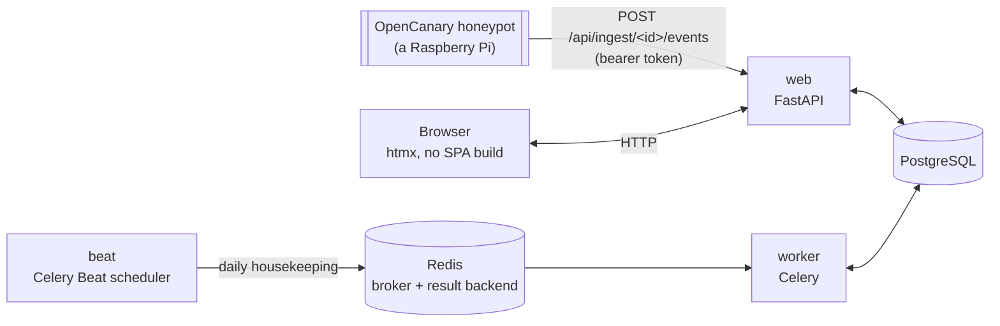

# 🏗️ Architecture

*Every honeypot lies for a living — this is the part of the app that has to tell the truth.*

## 🧱 Stack

| Layer | Choice | Notes |
|---|---|---|
| Language | Python 3.14 | |
| Web framework | FastAPI | async, OpenAPI schema for free |
| Templates / UI | Jinja2 + [htmx](https://htmx.org) (vendored locally) | no SPA build, no CDN |
| Database | PostgreSQL 18 | via `asyncpg` + SQLAlchemy 2.0 (async) |
| Migrations | Alembic | async engine |
| Task queue / broker | Redis | broker + result backend for [Celery](https://docs.celeryq.dev/); also backs the login rate limiter |
| Background tasks | Celery + Celery Beat | one `worker` process, exactly one `beat` scheduler — three daily housekeeping jobs, no per-honeypot fan-out (see below) |
| Auth: passwords | [`argon2-cffi`](https://github.com/hynek/argon2-cffi) | argon2id hashing for local accounts |
| Auth: LDAP | [`ldap3`](https://github.com/cannatag/ldap3) | pure Python |
| Auth: OIDC | [`Authlib`](https://authlib.org/) | discovery, authorization-code flow, ID token validation |
| Auth: TOTP | [`pyotp`](https://github.com/pyauth/pyotp) + [`qrcode`](https://github.com/lincolnloop/python-qrcode) | RFC 6238 two-factor codes |
| Auth: WebAuthn/passkeys | [`webauthn`](https://github.com/duo-labs/py_webauthn) | registration/authentication ceremony verification |
| Reverse proxy (optional) | [Caddy](https://caddyproxy.com/) | automatic HTTPS, TLS 1.3 only, HTTP/3 |
| Packaging / lockfile | [`uv`](https://docs.astral.sh/uv/) | `uv.lock` is committed |
| Containers | Docker (multi-stage build) + Docker Compose | |

This entire stack — and most of the code implementing the auth row — is
carried over from [debcontrol](https://github.com/sparkycz1/debcontrol),
a sister project for the same team. See [CLAUDE.md](../CLAUDE.md) for what
was and wasn't reused.



**The data flow is inverted from debcontrol's**: debcontrol's `web`
process reaches out over SSH to managed machines. Honeypot Shelf never reaches
into a honeypot at all — a honeypot's own forwarder pushes events in (see
[Honeypot Onboarding](Honeypot-Onboarding.md)). There is no SSH client
dependency in this codebase.

## 📂 Project structure

```
app/
  audit.py      the single audit-log write path (hash chaining, verification) — from debcontrol, unchanged
  auth/         login (local/LDAP/OIDC), sessions, TOTP, WebAuthn, per-user API tokens,
                company scoping (app/auth/scope.py) — see "Authentication & RBAC" below
  core/         config (pydantic-settings), logging, encryption, CSRF, editable app settings
  db/           SQLAlchemy models + async session
  schemas/      Pydantic schemas for forms
  services/     logic shared between routes (e.g. honeypot online/offline status)
  tasks/        Celery app (beat schedule, fork-safety hook) + the three daily job bodies
  web/          FastAPI routers, Jinja2 templates, static files
alembic/        DB migrations
wiki/           this documentation
```

## Authentication & RBAC

Login/session/TOTP/WebAuthn/LDAP/OIDC/rate-limiting/API-token machinery is
**copied from debcontrol nearly unchanged** — see that project's
`wiki/Architecture.md` for the exhaustive version of all of this (session
rows vs. signed cookies, brute-force lockout, per-IP rate limiting, TOTP
recovery codes, the WebAuthn ceremony, OIDC's own Starlette session, the
bootstrapping script). What's genuinely different is the authorization
model layered on top:

### No accounts are ever auto-created

Same as debcontrol: every `User` row is created inside Honeypot Shelf first
(`scripts/create_admin.py` for the very first superadmin, the Users page
after that) — never by LDAP or OIDC. `auth_provider` only decides *how* an
existing account proves who it is.

### RBAC: company + access level, not roles

An admin does **not** define custom roles here. Every user is either:

- **A superadmin** (`User.is_superadmin = True`) — `company_id` and
  `access_level` are both `NULL`. Sees and manages everything, every
  company.
- **A company user** — `company_id` (required) points at exactly one
  `Company`; `access_level` is `READ` or `READ_WRITE`. `READ_WRITE` always
  implies everything `READ` grants; there is no third tier, and no way to
  grant access to more than one company short of being a superadmin.

Enforced at two independent layers, same separation of concerns debcontrol
used for permissions vs. machine-group scoping:

- **`app.auth.dependencies.require_write`** — is this user allowed to
  write *at all* (superadmin, or `READ_WRITE` on their own company)? Gates
  a route the way debcontrol's `require_permission(Permission.X)` did.
- **`app.auth.scope.ensure_company_access(user, company_id, write=...)`**
  / **`visible_company_id(user)`** — *which* company's data may this user
  touch? A superadmin passes for every company id; anyone else only for
  their own. **Out-of-scope reads 404, never 403** — a 403 would itself
  confirm the company/honeypot exists, which a user outside it shouldn't
  learn for free (same reasoning debcontrol's machine-group scoping
  documents).

There is no per-honeypot grant, no multi-company non-superadmin user, and
no custom-role editor — see `app/db/models/user.py`'s module docstring for
why this is deliberately much flatter than debcontrol's `Role`/
`Permission` matrix, and [Home.md](Home.md)'s open questions for what's
still unsettled about who's allowed to do what.

**What a `READ` company user actually sees today**: Dashboard, the
Honeypots list, and — per honeypot — Overview, Monitoring, and Activity
(read-only: what OpenCanary has actually caught, no management implied).
Scheduling, `/api` (Swagger UI), and a honeypot's Updates/Terminal/Logs/
Config/Settings tabs are all write-tier — hidden from the nav/tab list
and `403` if reached directly. `READ_WRITE` gets all of it. Two of these
(Scheduling, `/api`) used to be reachable read-only by any logged-in
user — the nav link showed for everyone and neither route had a
`require_write` dependency at all; found and closed live. The honeypot
Activity tab moved the other direction: it used to share Terminal/Logs/
Config's write gate for no real reason and is now `READ`-visible.

### Sessions, TOTP, WebAuthn, API tokens, OIDC, rate limiting

All unchanged in mechanism from debcontrol — `UserSession` rows (not
signed cookies), the same `SESSION_IDLE_TIMEOUT`/`SESSION_ABSOLUTE_MAX`,
self-service TOTP enrollment with recovery codes, WebAuthn/passkey
registration, per-user API tokens (prefixed `hhpat_` here, not `dcpat_`)
that authorize whatever the owning user's company + access level currently
permit, and the same per-IP login rate limiter. One deliberate
simplification: **there is no per-role mandatory TOTP enforcement** (no
`Role.require_totp` — there are no roles). TOTP/passkeys are purely
self-service today; a future "require 2FA for every user" toggle would
need to live on `AppSettings` instead, checked in
`app.auth.middleware`.

WebAuthn's origin check and OIDC's `redirect_uri` both depend on
`request.url.scheme` being correct, which needs
`app.core.proxy_headers.ProxyHeadersMiddleware` (registered outermost in
`app.main`) to have corrected it from `X-Forwarded-Proto` first when the
app sits behind a TLS-terminating reverse proxy — otherwise both derive
"http" no matter what the browser actually used, and WebAuthn fails with
"Unexpected client data origin". See that module's own docstring and
`Settings.trusted_proxy_ips` for why trusting it by default is safe, and
[Installation](Installation.md) for the `TRUSTED_PROXY_IPS` setting. The
same middleware also fixes `app.audit.log_event`'s recorded source IP and
the login rate limiter behind a proxy — see "Real client IP behind a
proxy" below.

**Login is two steps**, not one form: `GET /login` collects only the
username (plus the OIDC button, if enabled — its label reads "Log in with
OIDC" unless `AppSettings.oidc_provider_name` names the actual provider,
e.g. "Entra ID", set on Settings → Integrations), then `GET
/login/password?username=...` offers a passkey *or* a password for that
account — a passkey there signs straight in with no password ever
submitted, the same GitHub/Google-style "next screen" shape. `username`
travels between the two as a plain query param, the same way `next`
already does elsewhere — it isn't a secret, and nothing trusts it for
anything beyond "whose passkeys to offer"; the real authentication
(password, still checked by the unchanged `POST /login` that screen's
password form submits to; or WebAuthn) is what actually verifies the
account. The passkey button is always shown on step two regardless of
whether the named account actually has one or even exists —
`app.web.routes.auth._resolve_webauthn_login_user`'s own docstring covers
why that's deliberate (enumeration-resistance: a nonexistent username and
a real one with no passkey get an identical error). A passkey used this
way needs no further second factor — it already *is* one — so it goes
straight to `_finish_login`, the same function a post-password TOTP/
passkey confirmation ends at. TOTP/passkey-as-second-factor after a
password (`/login/totp`) is unchanged.

**Real client IP behind a proxy.** `app.audit.log_event`'s recorded
`ip_address` and the login/TOTP rate limiter's per-source bucket key both
read `request.client.host` — correct out of the box when this app's own
network namespace is what a reverse proxy connects to, but the proxy's
own IP once one runs as a separate host/container (e.g. Traefik on a
different machine) instead. `Settings.trust_forwarded_for`
(`TRUST_FORWARDED_FOR`, off by default) tells the same
`ProxyHeadersMiddleware` above to also correct `request.client` from
`X-Forwarded-For` — off by default, unlike scheme trust, because trusting
it from just anyone would let an attacker spoof a different "source" on
every login/TOTP attempt and defeat the rate limiter entirely. Only turn
it on once `TRUSTED_PROXY_IPS` is narrowed to your real proxy's own
address (not the default `*`) — see `app.core.proxy_headers`'s own
docstring.

## 🌱 Initialize: provisioning a brand new device

[Initialize](Honeypot-Initialize.md) (top nav) is the one write path in
this app that connects over SSH to a device **that has no `Honeypot` row
at all** — every other SSH-connecting feature (`app.ssh.*`, all gated
through a real `Honeypot`) requires one first. It's a standalone,
one-shot provisioning script (`app.ssh.initialize`) adapted from the
team's own Ansible playbook, run before a device is ever added to
Honeypot Shelf. Because there's no prior `Honeypot.host_key_fingerprint` to
check against, host-key trust here is deliberately trust-on-first-use —
the one explicit exception to the strict pinned-verification policy
`app.ssh.client` otherwise enforces everywhere. A throwaway, never-
persisted `Honeypot` instance carries the connection details through to
the same `open_connection` helper (via the new `open_process_session`,
`app.ssh.client`'s non-interactive-streaming sibling of
`open_shell_session`) every other honeypot feature uses, so that policy
still applies uniformly once the (TOFU-trusted) fingerprint is set on it.

**Runs live in the web process, not Celery** — `app.web.routes.
initialize_ws`, the same WebSocket-direct-from-`asyncssh` shape
`terminal_ws.py` already uses for the interactive terminal, not the
dispatch-a-task-and-block-on-`.get()` pattern every other long SSH
operation in this app uses. A run can take up to an hour (`apt
full-upgrade`, compiling `pcapy-ng`) and the operator needs to *see* it
happening — a live output stream needs a long-lived connection a Celery
task can't hand back to an HTTP request. `POST /initialize` only
validates the form and stages the (never-persisted) connection details —
including a one-time password/NetBird key, if given — in
`app.web.routes.initialize.PENDING_RUNS`, an **in-process** dict keyed by
a random `run_id`; the redirected-to run page's WebSocket pops (single
use) and actually runs it. This assumes a single web process, true today
(see the `Dockerfile`'s plain `CMD ["uvicorn", ...]`, no `--workers`) —
same constraint `app.services.live_updates` already has for a related
reason, and the same fix (move it to Redis) would apply if that ever
changes.

**Second-to-last step: installs `authorized_keys`.** Honeypot Shelf's own
shared identity public key, plus every current superadmin's personal
key(s) (My account → SSH public keys, see "Superadmin personal SSH keys"
under "Security model" below), are appended — idempotently, additively,
home-dir-aware (`app.ssh.authorized_keys`) — to the account Initialize
connected as, so both Honeypot Shelf and every superadmin can reach the device
directly afterward without the one-time password/key this run itself
used. Skipped (not fatal) if there's nothing to install.

## 🔌 VPN connectivity: NetBird or WireGuard

**The problem**: every SSH-management-plane feature (terminal, facts,
updates, power, Scheduling, event ingestion's reverse direction) needs
`web`/`worker` to open a plain TCP connection to a honeypot's IP. That
fails outright for a honeypot that sits behind a NAT with no port
forwarded to it — a very common deployment shape for a honeypot
specifically (it's often placed on a network the operator doesn't fully
control, or deliberately kept off any inbound-reachable address). Two
ways to fix that, **mutually exclusive** — pick one in **Settings → VPN**
— because both work the same way structurally: `web`/`worker` themselves
join a virtual network as a peer, and so does the honeypot (via
[Initialize](Honeypot-Initialize.md)), and once both are peers on that
same network, a plain SSH connect to the honeypot's *tunnel* address just
works, no code changes anywhere else in this app.

| | NetBird | WireGuard |
|---|---|---|
| **Status** | ✅ Built | ✅ Built |
| **Solves NAT on both ends?** | Yes — NetBird's coordination/relay server (the public NetBird Cloud, or your own self-hosted management server) does the NAT traversal/hole-punching for you | **No** — plain WireGuard has no relay of its own. It only works if the WireGuard server the operator already runs (Honeypot Shelf and the honeypot both just join it as peers — see below) is itself reachable, and even then only *that* NAT (the server's) is solved, not each peer's |
| **What Honeypot Shelf enters** | A setup key + management URL (Settings → VPN) | A complete peer config — the same `.conf` a WireGuard server admin hands out to any other client (Settings → VPN) |
| **What a honeypot enters** (Initialize) | Its own setup key + management URL | Its own peer config |
| **"Log"** | The NetBird daemon's own log file, tailed | Thinner — WireGuard itself has no daemon/log; the closest equivalent is `wg-quick up/down`'s own command output plus `wg show` for live state |

### NetBird — built

**Why a sidecar, not NetBird inside `web`/`worker` directly**: the
WireGuard interface NetBird creates under the hood needs `CAP_NET_ADMIN`
+ `/dev/net/tun`, which this project's containers deliberately don't
have (every container runs as its own unprivileged user — see the
`Dockerfile`'s `USER app`). The optional `docker-compose.vpn.yml` overlay
(same convention as `docker-compose.caddy.yml`) instead adds one small
privileged `vpn` sidecar running *only* the NetBird daemon, and
`web`/`worker` join **its entire network namespace**
(`network_mode: "service:vpn"`) — borrowing its already-tunneled network
stack rather than gaining any privilege of their own, the same pattern
gluetun/wireguard-easy use elsewhere. They still reach `db`/`redis` by
service name as before; if you also run `docker-compose.caddy.yml`, its
`Caddyfile` keeps working unmodified since `vpn` claims `web`'s old DNS
alias once `web` stops having a network identity of its own.

`app.services.netbird` (in `web`) never talks to the sidecar container
directly — no Docker socket access, deliberately, since that's
root-equivalent. It only shells out to the `netbird` CLI (installed in
the shared image, fetched from NetBird's own release tarball rather than
the `.deb`, which wants a SysV init this image doesn't have), pointed at
the sidecar's daemon over a shared socket. Without the overlay applied,
that socket simply isn't there and every call fails with a clear "can't
reach the daemon" error — the whole feature is opt-in and harmless to
leave unconfigured.

**Settings → VPN** saves the setup key (encrypted, same as every other
stored secret) and management URL, and connects in one action — a setup
key is single-use on NetBird's own side anyway. Connect/disconnect/
restart are plain POSTs; status and the log tail are htmx-polled
partials, same live-panel pattern the honeypot detail page's facts/status
panels use. `app.main`'s lifespan reconnects automatically on every
`web` restart if a provider was left active (`AppSettings.vpn_provider`)
— otherwise a redeploy would silently leave a VPN-only honeypot
unreachable until someone noticed.

This is a **different** NetBird connection from the one on the
[Initialize](Honeypot-Initialize.md) form — that one joins the honeypot
*being provisioned*; this one joins Honeypot Shelf's own management-plane
containers. Both together are what's needed to reach a honeypot with no
other route to it.

### WireGuard — built

Per the product decision behind this design: Honeypot Shelf does **not** run
its own WireGuard server. It joins an **existing WireGuard server the
operator already runs somewhere reachable** as a plain peer — exactly
the same relationship a honeypot has to it too. Concretely, that means
Settings → VPN's WireGuard option is a **paste your peer config**
textarea (a standard `wg-quick`-style `.conf` — the same file any
WireGuard server admin tool already hands out per client/peer), not a
key-generation wizard: Honeypot Shelf doesn't need to know how to mint
WireGuard keys or manage a peer table, it just needs to bring up the
interface described by the config it's given, the same as a human running
`wg-quick up wg0` would. Initialize's WireGuard option is the same idea
applied to the honeypot being provisioned — paste that device's own peer
config, Initialize writes it to `/etc/wireguard/wg0.conf` over SSH and
brings the interface up there (needs `wireguard-tools` installed on the
honeypot too — an extra `apt-get install` alongside the existing
NetBird/OpenCanary setup in `app.ssh.initialize`).

**Why this needs its own small control-socket server, unlike NetBird**:
NetBird ships a daemon-plus-CLI split for free — `netbird service run`
listens on a socket, `netbird up/down/status` are a separate client
talking to it, which is exactly the shape needed to let `web` (unprivileged)
control something a privileged sidecar does. Plain `wireguard-tools` has
no such split — `wg-quick up`/`wg show` just run directly as one-shot
privileged commands, assuming the caller already has `CAP_NET_ADMIN`
itself. Since `web` deliberately doesn't, the sidecar runs a small
purpose-built stand-in for that daemon/CLI split: a tiny asyncio server
(`app.services.vpn_control_server`, started alongside the NetBird daemon
in `docker-compose.vpn.yml`'s `vpn` service) listening on its own Unix
socket inside the sidecar (`/var/run/vpn/control.sock`, another shared
volume, parallel to NetBird's own), speaking a minimal
newline-delimited-JSON protocol —

```
→ {"cmd": "wg_up", "config": "<the pasted .conf, verbatim>"}
← {"ok": true, "output": "..."}
→ {"cmd": "wg_down"}
→ {"cmd": "wg_status"}          # wraps `wg show wg0`
```

— run as root inside the sidecar (which already has `CAP_NET_ADMIN` +
`/dev/net/tun` for NetBird), writing the posted config to
`/etc/wireguard/wg0.conf` and shelling out to `wg-quick`/`wg` itself
(`iproute2` — `wg-quick`'s own dependency for the interface/route setup —
is installed in the image alongside `wireguard-tools`, since
`python:3.14-slim` doesn't ship it). On `web`'s side, `app.services.
wireguard` (mirroring `app.services.netbird`'s shape) is a plain Python
socket client — no special binary needed there beyond the standard
library, since it's just JSON over a Unix socket, not a CLI subprocess
this time. `wg_up` is idempotent (brings any previous session down first)
and `wg_down` tolerates "never connected"/"already down" the same way
`app.services.netbird.restart` tolerates NetBird's own `down` failing.

The sidecar's `command:` in `docker-compose.vpn.yml` starts *both* the
NetBird daemon and this control server unconditionally at boot (`bash -c
'... & ... & wait -n'` — both idle until actually used, and the whole
container restarts, per its own `restart: unless-stopped`, if either
backend process dies) — the provider choice lives entirely in Settings,
at runtime, never in which process a compose file happens to start, so
switching providers never needs a container restart.

**Mutual exclusivity, enforced server-side**: `AppSettings.vpn_provider`
(`none`/`netbird`/`wireguard`) is set automatically by whichever
`connect()` call last succeeded — never edited directly. Connecting one
provider best-effort disconnects the other first if it was active (see
`app.web.routes.settings._deactivate_other_provider`); both providers'
own saved config stays around either way, so switching back later doesn't
need re-entering it (only NetBird's setup key is genuinely one-shot, in
the sense of not being redisplayed once saved).

Initialize's own "VPN" field (None/NetBird/WireGuard, a same-`name` radio
group toggled via `static/js/toggle-hidden.js` — extended to support
radio groups, not just a single checkbox, for this) is the honeypot-side
counterpart, entirely independent of Honeypot Shelf's own choice above:
`app.ssh.initialize.build_initialize_command`'s `vpn_provider` parameter
installs at most one of `netbird`/`wireguard-tools` on the device (never
both, and neither when "None" is picked, unlike the old behavior which
always installed NetBird regardless), writes `/etc/wireguard/wg0.conf`
and runs `wg-quick up wg0` (plus `systemctl enable wg-quick@wg0`, so it
survives a reboot — WireGuard's own kernel interface doesn't need a
running daemon the way NetBird's connection does) for the WireGuard case.

## 🔒 Honeypot Config: read-only root filesystem + the OpenCanary module editor

The Honeypot Config tab has two independent live-SSH sections, neither
persisted in Honeypot Shelf's own DB (same "the honeypot's own state is the
only copy of the truth" philosophy the Logs tab documents):

**Read-only root filesystem** (`app.ssh.readonly`) toggles a managed
honeypot's root filesystem between writable and read-only, to protect its
SD card from write wear over a long unattended run. Uses Raspberry Pi
OS's own built-in overlay filesystem support (`raspi-config nonint
do_overlayfs 0|1`) rather than hand-written `/etc/fstab` edits — the
officially supported, vendor-tested mechanism for exactly this, and
trivially reversible the same way. Status is read live (`findmnt -n -o
FSTYPE /` — `overlay` means currently booted read-only). **Takes effect
on next reboot**, not immediately, and must be disabled before running
system updates (`apt` can't write to a read-only root) — see that tab's
own hint text; the Config tab now also shows an explicit "saved, reboot
to apply" banner (with a one-click reboot link) right after a toggle,
since neither `readonly_state` (the currently-*booted* state) nor
anything else on the page used to visibly change — a real toggle and a
silent failure looked identical, confirmed live as a genuine "does
nothing" bug. **Not literal read-only**: the vendor's own
`enable_overlayfs` (verified against `/usr/bin/raspi-config` itself, not
assumed) installs the `overlayroot` package with `overlayroot=tmpfs` on
the kernel command line — a RAM write layer over the real, read-only
root. Every write still succeeds at runtime (`/var/log/kern.log`,
`/var/log/samba-audit.log`, journald's own `/var/log/journal` if
present, anything) — it's only discarded on the next reboot, which is
exactly the intended trade-off, not a compatibility gap with anything
[Initialize](Honeypot-Initialize.md) sets up. `/mnt/tmpfs` (also
Initialize) stays worth having independently of this toggle — it spares
the SD card from OpenCanary's own log writes on every boot even for a
honeypot that never enables read-only root at all. **Also needs
`raspi-config` in the managed honeypot's sudoers grant** (see the module
editor's own note below — same "Fix it"/readiness-banner flow picks it
up on an already-onboarded honeypot).

**The OpenCanary module editor** (`app.ssh.opencanary_config`) is a
category-by-category form over every module in OpenCanary's own default
config (FTP, HTTP(S), SSH, Telnet, MySQL/MSSQL/MongoDB/Redis, RDP, VNC,
SIP, SNMP, NTP, TFTP, Git, LLMNR, a generic TCP banner listener, portscan,
and Samba — `OPENCANARY_MODULES` in that module, one dataclass-described
entry per category, driving both the form and the merge-on-save logic).
Loading the tab is a live `cat /etc/opencanaryd/opencanary.conf` over
SSH; each category's current enabled/disabled state is shown as a badge
right on its (collapsible) `<summary>`, so it's visible without expanding
anything. Saving reads the config fresh again, merges the submitted form
into it (`apply_form_to_config` — every key the schema doesn't manage,
notably the `logger` block and `telnet.honeycreds`, passes through
untouched), writes it back, restarts `opencanary`, and — the one place a
module's toggle needs more than opencanaryd itself — enables+starts or
disables+stops Samba's `smbd`/`nmbd` to match `smb.enabled`. No module is
ever force-enabled by Initialize or this editor's own defaults; flipping
a module on is always a deliberate, explicit save. **Needs the managed
honeypot's sudoers grant to include `systemctl` and `raspi-config`**
(added to `app.ssh.onboarding.build_onboarding_command`'s sudoers line,
checked by `app.ssh.readiness`'s `systemctl_sudo_ok`/
`raspi_config_sudo_ok` probes) — a honeypot onboarded before either
feature existed needs the existing "Fix it"/readiness-banner flow run
once to pick up the new grant(s); the read-only-root toggle above needs
`raspi-config` specifically, the module editor needs `systemctl`.

**Every successful save also tags the honeypot with its now-enabled
modules** (`app.services.honeypot_tags.sync_module_tags` — "ftp", "http",
"ssh", ...) and untags whichever module got turned off, per explicit
request. Never touches a tag outside that fixed vocabulary
(`app.ssh.opencanary_config.TOGGLEABLE_MODULE_KEYS`) — a tag added by
hand (`prod`, a site name, anything) survives every future save
regardless of what modules change.

## 🍯 Honeypot data model

- **`Company`** — a tenant. One row per customer.
- **`Honeypot`** — one deployed OpenCanary instance (one Raspberry Pi),
  belonging to exactly one `Company`. Identity + last-seen bookkeeping
  only; Honeypot Shelf never connects to it.
- **`HoneypotEvent`** — one row per OpenCanary alert, close to OpenCanary's
  own JSON shape (`raw`), with `event_type`/`occurred_at`/`src_ip`/
  `src_port`/`dst_port`/`source` promoted to real columns for the common
  list/filter/dashboard queries. Denormalizes `company_id` onto the event
  itself so every scoped query avoids a join through `Honeypot`.
- **`CompanySnapshot`** — one row per company per day, written by a daily
  Celery Beat job, backing the Dashboard's trend sparkline — mirrors
  debcontrol's `FleetSnapshot` one-to-one.

### How events actually arrive — two ways, same table

OpenCanary itself has no built-in "POST to a URL" output — it only writes
to a local log/its own handlers. Two independent mechanisms turn that log
into `HoneypotEvent` rows (`HoneypotEvent.source` records which one — both
go through the same `app.services.honeypot_events.build_event`, so a row
looks identical either way):

1. **Push** (`source="push"`) — `POST /api/ingest/{honeypot_id}/events`
   (`app/web/routes/ingest.py`) is what a small forwarder on the Pi calls,
   authenticated with the shared `INGEST_TOKEN` (bootstrap, same shape as
   debcontrol's `INFORM_TOKEN`). Needs a forwarder set up on the honeypot
   side — see [Honeypot Onboarding](Honeypot-Onboarding.md). (An earlier
   version also supported a per-honeypot token as an alternative to the
   shared one — removed: the SSH-poll path below already covers every
   honeypot without needing push configured per-device.)
2. **SSH poll** (`source="ssh_poll"`) — every
   `OPENCANARY_LOG_POLL_INTERVAL_SECONDS` (default 120, overridable per
   honeypot), Honeypot Shelf itself connects over the same SSH management
   plane every other periodic sweep uses and reads whatever's new in
   OpenCanary's own log (`app.ssh.canary_activity`, incremental by byte
   offset — `Honeypot.opencanary_log_offset`) — no forwarder needed at
   all. This is what backs the honeypot's own **Activity** tab
   (`app.services.canary_activity_history`): an aggregated trend chart by
   alert type plus a recent-alerts list, both reading straight from
   `HoneypotEvent`. `app.services.opencanary_logtypes` maps OpenCanary's
   numeric `logtype` ids (its own
   [`logger.py`](https://github.com/thinkst/opencanary/blob/master/opencanary/logger.py))
   to human labels and to the Honeypot Config tab's module keys, used by
   both the Activity tab and the Dashboard's recent-events list (the
   `canary_label` Jinja filter).

Running both against the same honeypot is fine — a poll never re-reads a
line it already saw (offset-tracked), and a forwarder's push is a
different physical alert than whatever the poll would separately pick up
from its own last-read position, so they don't produce duplicate rows for
the same log line.

"Online"/"offline" (`app/services/honeypot_status.py`) is derived from
`Honeypot.last_seen_at` vs. `HONEYPOT_OFFLINE_AFTER_SECONDS` — set by
either mechanism above. This is deliberately independent from
`is_reachable`/`last_ping_at`, the plain SSH-management-plane
reachability check every honeypot also gets (same as debcontrol's
`Machine`) — see `app/db/models/honeypot.py`'s module docstring for why
the two signals are kept apart.

**A poll bumps `last_seen_at` on any successful contact with the log
file, not only when it found a real alert.** Confirmed live as a real
bug: once `app.services.opencanary_logtypes.is_internal_logtype` started
filtering OpenCanary's own internal/operational lines out of storage (see
above), a quiet honeypot with no attacker traffic yet stopped getting
`last_seen_at` bumped at all — a poll with zero *alert* events used to
count as "not seen", so a perfectly healthy, reachable honeypot sat
"offline" on the Dashboard indefinitely. `_poll_honeypot_canary_log` now
bumps `last_seen_at` whenever `poll_log` itself succeeded (reached the
honeypot, read the log, got a well-formed response — `new_offset >= 0`),
exactly like a push to the ingest endpoint counts as "seen" regardless of
that event's own logtype. Storing an actual `HoneypotEvent` row is still
reserved for real alerts either way — this only changes what counts as
"alive".

The Monitoring tab's own **"OpenCanary service"** panel is a third,
separate signal from either of the two above — `systemctl is-active
opencanary`, piggybacked onto the same round trip the CPU/RAM/network
monitoring sample already makes (`app.ssh.monitoring.MONITORING_COMMAND`,
`HoneypotMonitoringSample.opencanary_active`), charted the same
uptime-style way `AvailabilityHistory.uptime_percent` is. It answers "was
the systemd unit itself reported active" — distinct from both SSH
reachability and from OpenCanary having emitted any events recently, and
useful specifically for catching an OpenCanary process that's dead while
the honeypot itself is still perfectly SSH-reachable.

### Three syslog targets, deliberately never mixed

This app forwards two completely different kinds of traffic to syslog,
across three independently-configured targets:

- **`app.audit_syslog`** — global, one target for the whole deployment,
  configured on Settings → Integrations (`AppSettings.syslog_*`). Carries
  every `AuditLogEntry` (every human-initiated mutation across the whole
  app — honeypot/company/user CRUD, logins, settings changes, ...) as it's
  written. **Never** a honeypot alert.
- **`app.services.honeypot_event_syslog`** — per-company, one target per
  `Company` (`Company.syslog_*`), configured on that company's own
  Integrations tab. Carries only that company's own honeypot *alerts*
  (real OpenCanary events — `is_internal_logtype` noise never even
  becomes a `HoneypotEvent` row, so it was never a candidate to forward
  in the first place), the instant one arrives via either ingestion path
  (`app.web.routes.ingest.ingest_event` or `app.tasks.jobs.
  _poll_honeypot_canary_log`). **Never** an audit log entry.
- **The fleet-wide alert target** (`AppSettings.fleet_alert_syslog_*`),
  configured on the "All honeypots" page's own Integrations tab
  (`app/web/routes/companies.py`) — not backed by a `Company` row at all
  (see `all_honeypots_company`'s own docstring for why "All honeypots"
  never is). Carries *every* honeypot's alerts, fleet-wide, regardless of
  company — **in addition to**, not instead of, that honeypot's own
  company target, if both happen to be configured; a central overarching
  SIEM alongside each tenant's own. Both are tried independently
  (`forward_honeypot_event_to_syslog`'s own docstring) — one being
  unreachable, disabled, or unconfigured never affects the other.

Why split by company rather than one shared alert target: this is a
multi-tenant deployment — company A's SOC shouldn't see company B's
alert traffic (or vice versa), and each may already run its own SIEM.
`HoneypotEvent.company_id` is denormalized onto the row precisely so this
lookup ("which target does *this* alert go to") never needs a join back
through `Honeypot` — see that model's own docstring.

All three share the same low-level transport
(`app.services.syslog_transport` — UDP/TCP/TCP-over-TLS, RFC 6587
octet-counting framing for the two TCP modes, `SyslogProtocol` used by
`AppSettings`' two target columns and `Company`'s own, all via the same
Postgres enum type) and the same message convention: **the RFC 5424 MSG
part is always a compact JSON object**, never free-text `key="value"`
pairs — a receiver's own parser (or `jq`) never needs a bespoke grammar
for any of them. All three are best-effort/fire-and-forget: the DB row
(an `AuditLogEntry`, or a `HoneypotEvent`) is always the source of truth,
this is only ever a live mirror of it, and a delivery failure at any
target is logged and swallowed, never allowed to affect the action/event
that triggered it or delivery to another target.

The "All honeypots" page also dropped its own bulk update/power sections
this same round (`trigger_all_honeypots_update`/`all_power_action` and
friends, removed from `app/web/routes/companies.py`) — the Honeypots
list's own bulk-select actions already cover the same ground with
finer-grained selection, making the separate "type ALL HONEYPOTS to
confirm" flow here redundant. The REST API's equivalent endpoints
(`app/web/routes/api_v1.py`) are untouched — this was a web-UI-only
removal.

### SMTP — configured, not yet wired to send anything

`AppSettings.smtp_*` (Settings → Integrations) holds an outbound mail
relay's connection details — host/port/`SmtpEncryption`
(none/STARTTLS/SSL-TLS)/username/password (encrypted, same convention as
`ldap_bind_password_encrypted`)/from address/from name. Deliberately
config-only for this round, per explicit instruction — `app.services.smtp`
exists as a stub with the planned shape documented in its own docstring;
nothing calls into it yet, and no notification feature exists to trigger
a send.

### Alert type labels are now localized

`app.services.opencanary_logtypes.localized_logtype_label` — a real bug,
found live: OpenCanary `logtype` labels ("SSH login attempt", "HTTP GET
request", ...) were hardcoded English everywhere, even on an otherwise
fully-translated Czech page (the Dashboard's "activity by alert type"
chart and the Activity tab's own chart/table). `logtype_label` (plain
English, unchanged) still backs every machine-consumed caller — the REST
API, CSV/JSON export, both syslog forwarders — deliberately: an API
response shouldn't vary by whichever session happened to trigger it.
Only the two template-rendering call sites
(`app.services.canary_activity_history`'s `build_activity_history`/
`summarize_recent_events`, and the `canary_label` Jinja filter used
directly in a couple of templates) go through the localized version,
threading `t(request, ...)` in as a plain `Callable[[object], str]`
default-argument override. i18n keys: `opencanary.event_label.<id>`, one
per known `logtype`, in every `app/i18n/locales/*.json` file.

### Live updates over WebSocket, and "Refresh now"

Every honeypot-scoped page (Overview, Monitoring, Activity, Updates)
opens one WebSocket to `GET /honeypots/{id}/live/ws`
(`app/web/routes/live_ws.py`) and turns each `{"kind": "..."}` message a
background job publishes (`app.services.live_updates.publish_honeypot_
event`) into a `live-<kind>` DOM event on `document.body`
(`app/web/static/js/live-updates.js`). Every htmx panel that polls on a
fixed interval also listens for its matching event, so it updates within
about a second of the job finishing rather than waiting out the poll —
see that file's own comments for the full design, including the
best-effort/at-most-a-doorbell reasoning (a publish carries no honeypot
data, just a kind, so a missed one costs nothing but a slightly later
refresh).

**Found live, previously undetected, fixed this round**: this whole
mechanism silently never worked, on any page, since this app's first
commit — a debcontrol leftover in `live-updates.js` looked for
`[data-live-machine-id]` (every template here has always set
`data-live-honeypot-id` instead) and built the socket URL as
`/machines/{id}/live/ws` (the real route has always been
`/honeypots/{id}/live/ws`). The selector mismatch meant the anchor lookup
always returned nothing, so the script no-opped immediately on every
load — every htmx panel that looked live-connected was actually running
on its polling fallback alone the whole time. Same class of bug as the
`machine_ids`/`honeypot_ids` bulk-select mixup this file's "Users list"
section already documents. Fixed, and the Activity tab (which never even
included the script or the anchor div before now) gained both.

Kinds today: `status` (reachability), `facts`, `packages`, `services`,
`updates`, and two added this round — `monitoring` (a fresh CPU/RAM/
OpenCanary sample) and `activity` (new OpenCanary log activity, published
from both the SSH-poll job and the push-ingest endpoint).

**The Monitoring and Activity tabs** also gained a "Refresh now" button
and one unified "Last checked" timestamp at the top of each, replacing a
separate timestamp that used to sit under every individual graph
(Availability's own "latest check," the OpenCanary panel's own, ...) —
now those just show a plain status badge, with the *when* answered once,
in one place. Each tab's actual content lives in its own partial
(`partials/honeypot_monitoring_content.html`/`honeypot_activity_content.
html`), shared by three routes: the first-paint page, a `-panel` GET the
page's own auto-poll/live-update div re-fetches, and a `POST .../refresh`
that forces a fresh sample (`sample_honeypot_monitoring`+
`check_honeypot_reachability`, or `poll_honeypot_canary_log`) and waits
for it synchronously before re-rendering — same "enqueue a Celery task,
then block on its result" shape `refresh_facts_endpoint` already used for
the Overview tab's own "Refresh facts" button.

## 🌐 The REST API: read and write, mirroring the web UI

`app/web/routes/api_v1*.py` — authenticated with a per-user API token
(`Authorization: Bearer <token>`, minted from that account's own
`/account` page, see `app.auth.api_tokens`/`app.auth.dependencies.
get_api_token_user`), not a session cookie. A token can do whatever its
owning account currently permits, company-scoped exactly the way the web
UI is (`app.auth.scope.visible_company_id`/`honeypots_visible_to`) — it's
a second door into the same house, not a looser one, and it stops working
immediately if the account's access changes or it's deactivated.

Deliberately still web-UI-only, and why: SSH key rotation
(`/settings/ssh-key/...`), LDAP/OIDC configuration, and syslog forwarding
are excluded because each one is either a secret/credential surface or
carries a lock-out/blast-radius risk meant to be handled deliberately, by
a human, not scriptable. The interactive SSH terminal
(`app/web/routes/terminal_ws.py`) is excluded for a different reason: an
inherently interactive, browser-only WebSocket relaying keystrokes to a
PTY, with no meaningful "REST" shape — nothing for a script to call that
would do anything useful without a human driving it. A *fresh*, one-time
password submitted through the "Fix it" readiness flow is excluded for
the same secret-handling reason SSH key rotation is; the equivalent using
the credential already on file has an API route. CSV bulk import of
pending honeypots is excluded too — a script importing honeypots already
has `POST /honeypots` (or `POST /api/inform` for genuine
self-registration).

`GET /api/v1/events` (+ `/export`, CSV or JSON — `app/web/routes/
api_v1_events.py`) is the read surface over `HoneypotEvent`: filterable by
`honeypot_id`/`event_type`/`source`/`since`/`until`, paginated on the
plain list endpoint, unpaginated (same tradeoff the audit log's export
makes) on `/export`. Mirrors `app/web/routes/audit.py`'s/`api_v1_audit.
py`'s CSV-export shape (`_csv_safe`'s spreadsheet-formula-injection
guard included) — and the honeypot Activity tab's own `GET /honeypots/
{id}/status/export` (session-authenticated, not a REST API route, since
it's a plain `<a href>` download link on that page) reuses the same
shape again, scoped to one honeypot instead of a whole company/fleet.

## 🔒 Security model

CSRF, CSP (strict, no inline scripts/styles, no CDN — htmx and Swagger UI
vendored locally), security headers, secrets-at-rest encryption
(`ENCRYPTION_KEY`, AES-256-GCM — used for LDAP/OIDC secrets, honeypot SSH
credentials, NetBird/WireGuard config, and TOTP secrets), SSH host-key
pinning (no trust-on-first-use — identical to
debcontrol's `Machine`), and the hash-chained audit log are all unchanged
from debcontrol in spirit. See that project's `wiki/Architecture.md`
"Security model" section for the exhaustive version — it applies here
without modification for everything under `app/ssh/`.

**Deliberately out of scope** (unlike debcontrol): no AI assistant, no
user-definable roles (see "Authentication & RBAC" above for what replaces
them).

### Secrets at rest

`app.core.security` encrypts every `LargeBinary` `*_encrypted` column
across `app/db/models/` with **AES-256-GCM** — a fresh random nonce per
value, keyed by the full 32 raw bytes behind `ENCRYPTION_KEY`.
`decrypt_secret` also still transparently reads a value stored in the
older **Fernet** (AES-128-CBC + HMAC-SHA256) format this app used before
v0.17.0, so nothing already in the database needs an immediate migration
— `scripts/reencrypt_secrets.py` optionally upgrades every remaining
legacy value in one idempotent pass (see
[Installation](Installation.md#upgrading-stored-secrets-to-aes-256-gcm)).
`ENCRYPTION_KEY` itself is unchanged (still `Fernet.generate_key()`'s
output from `scripts/generate_secrets.py`) — just now decoded straight to
32 raw bytes for AES-256 rather than handed to `Fernet()` as-is.

### FIPS alignment

Honeypot Shelf does not claim FIPS 140-2/140-3 **certification** — that means
running against a NIST-validated cryptographic module (a CMVP
certificate), a build/deployment decision (which OpenSSL build, which
base image) no amount of application code can grant on its own. The stock
`python:3.14-slim` base image and the `cryptography` package's own
vendored (Rust-built) OpenSSL are **not** FIPS-validated modules as
shipped.

What the app *can* control — and does — is never relying on an algorithm
FIPS wouldn't approve, so a deployment that needs the real certification
only has to swap the underlying crypto module, not rewrite anything here:

- **Secrets at rest**: AES-256-GCM (above), not Fernet's AES-128 — both
  are FIPS-approved ciphers, this is "prefer the stronger modern default"
  rather than fixing a real weakness.
- **Signed tickets** (`app.auth.sessions`'s pending-TOTP and WebAuthn
  challenge tickets, `itsdangerous`) — explicit
  `digest_method=hashlib.sha256` rather than `itsdangerous`'s own
  HMAC-SHA1 default. HMAC-SHA1 is itself still FIPS-approved for a MAC, so
  again not a real weakness fixed, just one non-approved-*looking* default
  removed from an otherwise SHA-2-only app.
- **Session tokens and the SSH host-key fingerprint** already used
  SHA-256 from the start (`app.auth.sessions`,
  `app.ssh.client.FINGERPRINT_HASH`) — nothing to change there.
- **SSH connections to a honeypot** (`app.ssh.client.open_connection`)
  restrict key exchange, encryption, and MAC algorithms to an approved
  subset — NIST-curve ECDH (P-256/384/521) or ≥2048-bit finite-field DH
  with SHA-2, AES-GCM/AES-CTR, and HMAC-SHA-2 — excluding AsyncSSH's own
  broader defaults (`curve25519`/`curve448` key exchange,
  `chacha20-poly1305`, legacy ciphers, SHA-1/MD5 MACs). Deliberately
  **not** applied to `discover_host_key_fingerprint` (the unauthenticated
  probe that exists to *learn* whatever host key type a honeypot has — it
  must stay unrestricted) or to the server host-key algorithm a connection
  will accept (this app pins a host key by its exact fingerprint, not its
  algorithm; narrowing that list could lock out a honeypot already pinned
  on an Ed25519 key, whose signature algorithm isn't FIPS-approved but
  whose key fingerprint is verified out-of-band regardless).
- **TOTP** (HMAC-SHA1 per RFC 6238) and **WebAuthn/passkeys**
  (ECDSA P-256 / RSA) already only use approved algorithms — nothing
  changed for either.

**The one deliberate exception: Argon2id for password hashing**
(`argon2-cffi`, `app.auth.security`). FIPS/SP 800-132 only approves
PBKDF2 for password-based key derivation — Argon2id isn't on that list at
all. This app keeps Argon2id anyway: it's memory-hard, meaningfully more
resistant to GPU/ASIC cracking than PBKDF2, and that resistance is exactly
what protects an account if the password hash table itself ever leaks.
Swapping it for PBKDF2 would trade a real security property for a
checkbox, so treat this as a considered trade-off, not an oversight, in
any FIPS gap assessment of this app.

### Rolling back a honeypot update

Every real `HoneypotUpdateRun` (not a rollback of one) now captures a
`dpkg-query` package-version snapshot right before the upgrade step runs
(`app.ssh.updates.capture_package_snapshot`) — a failure here (unreachable
honeypot, timeout) is logged and never fails the update run itself, it
just means "Roll back this update" isn't offered for that particular run.
"Roll back this update" (the update-run detail page, and `POST
/honeypots/{id}/updates/{run_id}/rollback` on both the web UI and REST
API) diffs a **freshly captured** current snapshot against that stored
one and re-installs, pinned by exact `package=version`, only whatever
actually changed since — never a blind replay of the whole snapshot, so a
rollback days later doesn't also revert something else updated in the
meantime for unrelated reasons, and running it twice is a fast no-op the
second time. Requires the old `.deb` to still be resolvable from a
configured apt source (the local cache, an unchanged mirror, or a
snapshot/pinning repo) — if it's gone, apt reports it can't locate that
version, surfaced in the run's output like any other apt failure. Creates
a brand new `HoneypotUpdateRun` row (`rollback_of_run_id` pointing at the
source run) rather than mutating the original, so both stay in the
history exactly as they happened; a rollback run itself can't be rolled
back further. Same write scope as running an update in the first place —
undoing an update isn't a higher trust level than running one.

### Superadmin personal SSH keys

`User.ssh_public_keys` (My account → SSH public keys) lets a superadmin
paste their own personal SSH public key(s) — one `authorized_keys`-ready
line each, validated on save (`app.auth.ssh_keys.parse_ssh_public_keys`,
via `asyncssh.import_public_key` — the whole submission is rejected, not
partially saved, if any line doesn't parse) — for logging into a honeypot
directly, alongside Honeypot Shelf's own management access. **Superadmin-only
by design**: the field, and the "Push to every honeypot" button next to
it, only appear for a superadmin account, and both the field's stored
value and the button's route are only ever *read* for a superadmin (a
company-scoped user can technically still have a row in the same column
via direct DB access, but nothing in the app surfaces it or reads it) —
granting host-level SSH into the whole fleet is a superadmin-tier
capability the way superadmin itself is, not something company scoping
should ever widen. Two things read it:

- **Initialize** (see above) installs every current superadmin's key(s),
  plus Honeypot Shelf's own shared identity key, onto a freshly provisioned
  device.
- **"Push to every honeypot"** (`/account/ssh-keys/push`,
  `app.tasks.jobs.push_superadmin_ssh_keys`) does the same for the
  *existing* fleet — every honeypot with a pinned host key, regardless of
  its own `auth_method` (unlike Settings → SSH identity's own "Push
  pending key" button, which only ever targets an `AuthMethod.SSH_KEY`
  honeypot, since that one's specifically about rotating the app's own
  connection credential — a personal key grants independent access, not
  tied to whatever the app itself currently authenticates with).

Both paths, and Settings' own SSH-identity push, share the same
`app.ssh.authorized_keys.build_authorized_keys_append_command` — home-dir
aware (`getent passwd`, not a literal `~`, since the caller may be running
wrapped under one `sudo` for the whole script, where `~` would resolve to
the *escalated* account's home rather than the target's) and, critically,
**strictly additive**: every key is `grep -qxF`-checked before being
appended, so a key added by hand — or by an earlier push — is never
overwritten, duplicated, or at risk from a later one.
