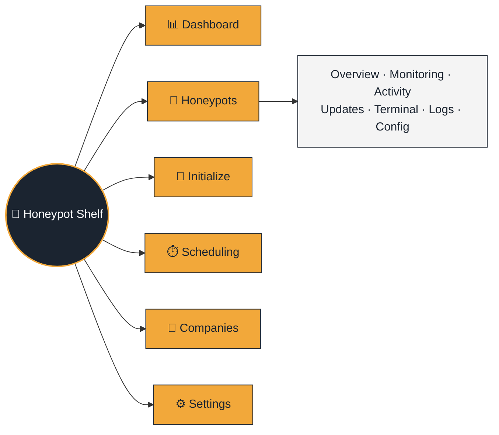

  

<h1 align="center">🐝 Honeypot Shelf</h1>

<em>A fleet of decoys, watched from one browser tab — every fake login attempt lands here first.</em>

---

Management and monitoring for a fleet of
[OpenCanary](https://github.com/thinkst/opencanary) honeypots (Raspberry
Pis at customer sites), scoped per **company** — every page needs a login
(local, LDAP, or OIDC, plus TOTP/passkey 2FA), and what an account can see
is gated by RBAC (see [Architecture](Architecture.md#authentication--rbac)).
A honeypot is managed exactly like a machine in
[debcontrol](https://github.com/sparkycz1/debcontrol) (a sister project
for Debian fleets, where this project's stack, layout, auth system, and
SSH management layer were all ported from) — plus this project's own
addition: an SSH poll reads OpenCanary's own events straight off each
honeypot, and the Dashboard sums them per company. Full "what was reused
vs. what's different" story in
[CLAUDE.md](../CLAUDE.md); this page is the map, not the territory.

> [!NOTE]
> Two independent "is it alive" signals per honeypot, and they mean
> different things: `is_reachable` is a plain SSH-plane ping; `last_seen_at`
> is "the SSH log poll last found OpenCanary itself alive." A honeypot
> can be reachable with OpenCanary dead, or vice versa — see
> [Architecture](Architecture.md#honeypot-data-model).

## 📑 Read next

| Page | For when you need to... |
|---|---|
| [🚀 Installation](Installation.md) | Stand the thing up — Docker, reverse proxy, backups |
| [🏗️ Architecture](Architecture.md) | Understand *why* it's built this way (the deep-dive reference) |
| [🌱 Initialize](Honeypot-Initialize.md) | Provision a brand-new Raspberry Pi into a honeypot over SSH |
| [🛠️ Development](Development.md) | Run it locally, add a feature, ship a migration |

## 🔒 Sitting behind a reverse proxy

Honeypot Shelf only ever speaks plain HTTP (port `8080`) — it expects a
TLS terminator in front of it, always. Pick your fighter:

- **[Caddy](Reverse-Proxy-Caddy.md)** — bundled, zero-config HTTPS. The easy button.
- **[nginx](Reverse-Proxy-Nginx.md)** — you already run one for everything else.
- **[Traefik](Reverse-Proxy-Traefik.md)** — you're already all-in on Docker labels.

## ✨ What's in the box

| Tab | The highlights (not the whole story — see [Architecture](Architecture.md)) |
|---|---|
| 📊 **Dashboard** | Fleet counts (online/offline, needs-updates), a trend sparkline, and a fleet-wide "activity by alert type" breakdown |
| 🍯 **Honeypots** | Facts, packages, live monitoring (with an **OpenCanary service** up/down graph), a browser SSH terminal, log browsing, an **Activity** tab reading OpenCanary's own log over SSH, a **Config** tab (read-only-root toggle + a full editor for every OpenCanary module), tags & saved views, bulk actions, JSON/CSV export, and **update rollback** if a `dist-upgrade` goes sideways |
| 🌱 **Initialize** | Turns a blank Raspberry Pi OS install into a working honeypot over SSH — packages, the OpenCanary service, NetBird, live streamed progress, a persisted run history |
| ⏱️ **Scheduling** | Cron any action against a honeypot/company/fleet — updates, power, custom commands, on-demand "force a sweep now" debug buttons |
| 🏢 **Companies** | Each company's own page (users + honeypots), a per-company syslog target for that company's own alerts, plus the "All honeypots" virtual company and its own fleet-wide alert target |
| 📚 **API docs** (`/api`) | Live Swagger UI over the full read/write REST API — everything the web UI can do, an API can too |
| ⚙️ **Settings** | SSH key rotation, **Checks & retention** (background-check timeouts/intervals plus every retention policy, database-backed — no restart to change most of it), the shared **Notifications** email templates, LDAP/OIDC/syslog/SMTP integrations, VPN (NetBird or WireGuard) |

Want the granular, paragraph-by-paragraph feature list this page used to
carry? That level of detail lives where it belongs — next to the *why*,
in [Architecture](Architecture.md) — so this page stays something you can
actually read in one sitting.

## 🔒 Settled product decisions

- **Who can create a company/honeypot/user?** Superadmin only. A company
  user (`READ`/`READ_WRITE`) never creates a company or another user —
  a `READ_WRITE` user *does* manage the honeypots already in their own
  company (create/edit/delete, terminal, updates, power). Companies,
  Users, Settings, and the Audit log stay superadmin-only end to end.
- **Notifications**: self-service, per-user email alerts — any user,
  regardless of access level, can subscribe their own account (or a
  manually-entered address) to honeypot-alert and/or unavailability
  emails for any honeypot they can see, from My account → Notifications.
  Deliberately much simpler than a role/condition-based rules engine — see
  [Architecture](Architecture.md#notifications-self-service-per-honeypot-email-alerts).
  The three syslog targets (global audit-only, per-company alerts,
  fleet-wide alerts — see
  [Architecture](Architecture.md#three-syslog-targets-deliberately-never-mixed))
  remain the "forward to your own SIEM" path, unrelated to this.
- **Retention defaults**: events, audit log entries, and dashboard trend
  snapshots all default to 90 days — still adjustable from Settings.
- **Impersonate**: a superadmin can sign in as any other (non-superadmin)
  account for support/debugging, from the Users list — see
  [Architecture](Architecture.md#impersonate-a-superadmin-signing-in-as-another-account)
  for the safeguards and audit trail.

### Still open

- **A map/geo view** — doesn't exist yet. CSV export and per-event-type
  breakdowns are done (Activity tab, Dashboard, `GET /api/v1/events`).
