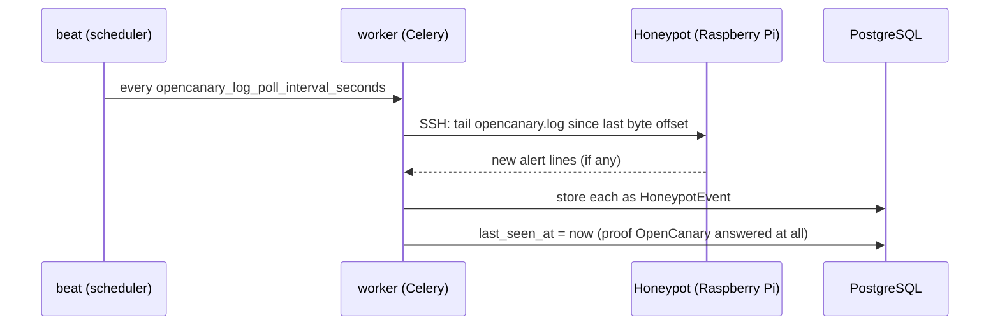

# 🍯 Honeypot Management

*SSH in, ask nicely, never trust a first handshake.*

Everything here is ported from debcontrol's own machine-management layer
close to unchanged — a `Honeypot` is managed exactly like a debcontrol
`Machine` (facts, packages, monitoring, updates, terminal, logs,
scheduling). This page covers what's genuinely different: how a
honeypot gets provisioned, reached, and how its own OpenCanary events
get in.

## 🌱 Provisioning a brand-new device

[Initialize](Honeypot-Initialize.md) is the one write path that SSHes
into a device **with no `Honeypot` row at all** — everything else in
`app/ssh/*` requires one first. With no prior host-key fingerprint to
check, trust here is deliberately trust-on-first-use — the one
exception to the pinned-verification policy `app.ssh.client` enforces
everywhere else.

Runs live in the web process, not Celery (a run can take up to an hour
and the operator needs to *watch* it). Its second-to-last step installs
this app's own shared identity key plus every superadmin's personal
key(s) into the connected account — idempotently, additively — so both
the app and every superadmin can reach the device directly afterward.

### Superadmin personal SSH keys

`User.ssh_public_keys` (My account) lets a superadmin paste their own
key(s) for logging into a honeypot directly — superadmin-only by
design, since granting host-level SSH into the whole fleet is a
superadmin-tier capability, not something company scoping should ever
widen. Two things read it: **Initialize** (installs every current
superadmin's key on a fresh device) and **"Push to every honeypot"**
(does the same for the existing fleet). Both, and Settings' own
SSH-identity push, share one command builder — **strictly additive**:
every key is checked before being appended, so a key added by hand is
never overwritten or duplicated.

## 🔌 VPN connectivity: NetBird or WireGuard

**The problem**: SSH-management-plane features need `web`/`worker` to
open a plain TCP connection to a honeypot — impossible if it sits
behind a NAT with no forwarded port, a common shape for a honeypot
specifically. Two fixes, **mutually exclusive**, picked in
**Settings → VPN**: `web`/`worker` join a virtual network as a peer,
the honeypot joins the same one (via Initialize), and a plain SSH
connect to its tunnel address just works.

| | NetBird | WireGuard |
|---|---|---|
| **Solves NAT on both ends?** | Yes — NetBird's own relay/coordination server does the hole-punching | **No** — needs a WireGuard server the operator already runs |
| **What this app enters** | A setup key + management URL | A complete peer `.conf`, same as any other client gets |
| **"Log"** | The NetBird daemon's own log, tailed | Thinner — `wg-quick`'s own output plus `wg show` |

Both run inside an optional privileged `vpn` sidecar
(`docker-compose.vpn.yml`); `web`/`worker` borrow its network namespace
rather than gaining privilege of their own. `AppSettings.vpn_provider`
is set only by whichever `connect()` last succeeded, never edited
directly — connecting one best-effort disconnects the other. This is a
**different** NetBird connection from the one on the Initialize form —
that one joins the honeypot being provisioned; this one joins this
app's own containers.

## 🔒 Honeypot Config: read-only root + the OpenCanary module editor

Two independent live-SSH sections, neither persisted in this app's own
DB — the honeypot's own state is the only copy of the truth.

**Read-only root filesystem** protects the SD card from write wear via
Raspberry Pi OS's own overlay filesystem — takes effect on next reboot,
not immediately (the Config tab says so explicitly). Not literal
read-only: every write still succeeds at runtime, just discarded on
reboot.

**The OpenCanary module editor** is a category-by-category form over
every OpenCanary module (FTP, HTTP(S), SSH, Telnet, databases, RDP,
VNC, SIP, SNMP, NTP, TFTP, Git, LLMNR, a TCP banner listener, portscan,
Samba). Saving re-reads the live config, merges the form in, writes it
back, restarts `opencanary`. No module is ever force-enabled by
Initialize or this editor's own defaults. Every successful save also
tags the honeypot with its now-enabled modules — a manually-added tag
survives every future save.

## 🍯 The data model

- **`Company`** — a tenant. One row per customer.
- **`Honeypot`** — one deployed OpenCanary instance, attached to any
  number of companies via a plain link table, including zero (visible
  to a superadmin only). Identity + last-seen bookkeeping only; this
  app never connects to it proactively.
- **`HoneypotEvent`** — one row per OpenCanary alert, close to
  OpenCanary's own JSON, with the common filter fields promoted to real
  columns. Scope is derived by joining through the honeypot's companies
  at query time, since a honeypot can belong to several.
- **`CompanySnapshot`** — one row per company per day, backing the
  Dashboard's trend sparkline.

A company's own page can *attach* an already-existing honeypot or
*grant* an already-existing user access, additively — never detaching
either from wherever else they already are. Deleting a `Company` only
ever removes *links*, never the honeypot or user account itself.

## 📡 How events arrive: an SSH poll, nothing pushed

OpenCanary has no built-in "POST to a URL" — it only logs locally. Every
`AppSettings.opencanary_log_poll_interval_seconds` (Settings → Checks &
retention, default 120), this app connects over SSH and reads whatever's
new in that log, incrementally by byte offset — no setup needed on the
honeypot side beyond a pinned host key. Backs the **Activity** tab.

**"Online"/"offline"** is `last_seen_at` vs.
`HONEYPOT_OFFLINE_AFTER_SECONDS`, deliberately separate from
`is_reachable`/`last_ping_at` (a plain SSH-plane ping — see the note on
[Home](Home.md)). A poll bumps `last_seen_at` on **any** successful
contact with the log, not only when it found a real alert, so a quiet
but healthy honeypot doesn't sit "offline" forever for lack of attacker
traffic. The Monitoring tab's **"OpenCanary service"** panel is a third
signal — `systemctl is-active opencanary`, piggybacked on the same
round trip the CPU/RAM sample already makes.

## Three syslog targets, deliberately never mixed

- **Global** (`app.audit_syslog`, Settings → Integrations) — every
  `AuditLogEntry`. Never a honeypot alert. See [Audit Log](Audit-Log.md).
- **Per-company** — one target per `Company`, that company's own
  Integrations tab. An alert from a honeypot shared across companies
  goes to **every** one of its companies' own targets. Never an audit
  entry.
- **Fleet-wide** — "All honeypots" → Integrations, not backed by any
  `Company` row. Every honeypot's alerts, **in addition to** the
  per-company target if both are set.

Split by company because this is multi-tenant — company A's SOC
shouldn't see company B's traffic. All three share one transport
(UDP/TCP/TCP-over-TLS) and one convention: the RFC 5424 MSG part is
always a compact JSON object, never `key="value"` text. All
best-effort — a delivery failure is logged and swallowed.

## Settings → Checks & retention: database-backed, not `.env`

Every background-check timeout/interval and every retention policy
lives on `AppSettings` (Settings → **Checks & retention**), not `.env`
— a change applies without a restart for the timeouts/concurrency cap
(read fresh from the database on every call), but the four sweep
*intervals* (reachability/facts/monitoring/OpenCanary-log-poll) still
only take effect on the next `worker`/`beat` restart, since a Celery
`beat_schedule` entry's `schedule` is a plain value computed once at
import time. Ported from an identical debcontrol change.

## Small but worth knowing

- **Alert type labels are localized** for the two template-rendering
  call sites — the REST API, exports, and both syslog forwarders keep
  the plain English label on purpose, since a machine-consumed response
  shouldn't vary by session.
- **Live updates over WebSocket**: every honeypot-scoped page opens one
  WebSocket and turns each background-job message into a DOM event, so
  a panel updates within about a second instead of waiting out its poll
  interval. The Monitoring and Activity tabs also have a "Refresh now"
  button.
- **Update rollback**: every real update run captures a package-version
  snapshot right before upgrading. "Roll back this update" diffs a
  fresh snapshot against that stored one and re-installs, pinned by
  exact version, only whatever actually changed since.
