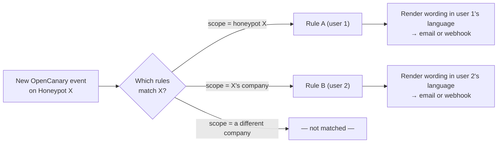

# 🔔 Notifications

*Your honeypot lies to attackers all day — the least it can do is tell you the truth by email.*

Nav bar → Notifications, open to **every** logged-in user regardless of
access level — anyone creates their own named `NotificationRule`s, each
scoped to either an entire company they can already see or a single
honeypot. Deliberately much simpler than debcontrol's own Notifications
(admin-authored rules, role-targeted recipients, condition thresholds)
— matching this app's flatter RBAC and an explicit decision to keep
rule creation self-service, open to every access level.

## Building a rule: what, why, how, where

The create/edit form asks the same four questions in order, then shows
the actual wording last:

1. **Co (what)** — a whole **company** (covers every honeypot in it,
   including ones added later — re-resolved on every sweep, no rule
   edit needed) or a single **honeypot**. A superadmin can pick any
   company; anyone else only one they already have access to — checked
   server-side, not just by what the picker offers.
2. **Proč (why)** — which of the three events fire it, each independently:
   - **New alert** — every newly ingested OpenCanary event.
   - **Becomes unavailable** — continuously unreachable for at least
     *this rule's own* threshold (minutes).
   - **Becomes available again** — continuously reachable again for at
     least *this rule's own* threshold, and only after an "unavailable"
     notification actually fired for it — a blip that recovers before
     its own threshold never claims "it's back" for something that was
     never reported down.
3. **Přes co (how)** — email (default) or a webhook POST.
4. **Kam (where)** — for email, defaults to your own account email;
   override it per rule (e.g. a shared team alias). For webhook, the
   URL — must resolve to a public address (see the SSRF note below).
5. **The actual wording**, collapsed at the end — one subject/body pair
   per event kind, prefilled with the built-in default text *in your
   own current UI language*, editable per rule. Leave a field blank to
   keep using that default — including any future translation, if you
   later switch your own UI language. There's no shared, admin-edited
   template any more (see "What changed" below).

## What changed from the first version

Notifications used to be one row per (user, honeypot) with a fixed
instance-wide template per event, superadmin-edited in Settings. Two
things this redesign replaced, both by explicit request:

- **Scope widened from "one honeypot" to "a honeypot, or a whole
  company"** — `NotificationRule` (was
  `HoneypotNotificationSubscription`), a named row instead of an
  anonymous toggle, letting one person hold several rules for different
  purposes.
- **Wording moved from one shared, superadmin-only template to a
  per-rule override** — Settings no longer has a "Notifications" tab at
  all; every rule's own wording lives with the rule.

No data-migration path for the old subscriptions — a young,
self-service-only feature with a small blast radius; recreate them as
rules.

## The debounce, mechanically

Because a company-scoped rule can cover many honeypots that each go
up/down independently, "have we already notified for this outage" can't
live on the rule itself the way a honeypot-scoped one could — it's a
separate `NotificationRuleState` row per (rule, honeypot) pair, created
lazily the first time a sweep evaluates that pairing, and reset once the
matching notification fires. Both `Honeypot.unreachable_since` and its
mirror `reachable_since` track when the *current* streak started —
distinct from `last_ping_at`, which is overwritten every sweep tick
regardless of outcome. Both event kinds hook directly into the existing
reachability and log-poll sweeps — no new Celery Beat schedule entry.

## Delivery, history, and "Send test"

A webhook rule fires even when SMTP is off; an email rule is silently
skipped if SMTP isn't configured. Every send attempt — real or test —
is logged (`NotificationLog`, purged on its own configurable retention,
Settings → Checks & retention), and each user sees only their own last
200 attempts at Notifications → Notification history. "Send test" fires
one synthetic alert straight to a rule's current channel/target,
against a real honeypot in its scope, bypassing rule-matching and
debounce state entirely.

## The SSRF guard on webhooks

Because a webhook URL here is entered by *any* logged-in user, not just
a superadmin authoring a rule (debcontrol's own trust boundary), it's a
real SSRF vector without a guard — a low-privileged account could
otherwise point it at a cloud metadata endpoint or another container on
the compose network and use `worker` as a network probe. The URL is
resolved and checked against every non-public address class (loopback,
link-local, private, reserved, multicast, unspecified) both when a rule
is saved and again immediately before every send — defending against
the resolved address changing between the two, a classic DNS-rebind.
